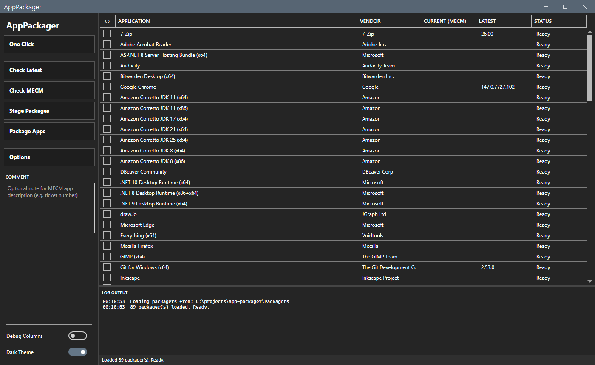

# AppPackager

PowerShell scripts and a MahApps.Metro WPF GUI that automatically package the latest version of common enterprise applications into Microsoft Endpoint Configuration Manager (MECM) applications.

## What It Does

Each packager script operates in two phases:

**Stage** — Downloads the latest installer from the vendor's official source, extracts metadata (version, publisher, detection info), generates install/uninstall wrapper scripts, and writes a `stage-manifest.json`. Everything is built locally under a configurable download root. No network share or MECM required.

**Package** — Reads the stage manifest, copies the content folder to a versioned UNC network share, and creates an MECM Application with the appropriate deployment type and detection method.

The GUI (`start-apppackager.ps1`) provides a visual front-end that discovers packager scripts automatically, lets you check latest versions, query MECM for current versions, and stage or package selected applications.



## Prerequisites

| Requirement | Details |
|---|---|
| **OS** | Windows 10/11 or Windows Server 2016+ |
| **PowerShell** | 5.1 (ships with Windows) |
| **.NET Framework** | 4.7.2 or later (4.8 recommended; required by WPF GUI and MahApps.Metro) |
| **ConfigMgr Console** | Installed locally — provides `ConfigurationManager.psd1` (Package phase only) |
| **MECM Permissions** | RBAC rights to create Applications and Deployment Types (Package phase only) |
| **Local Admin** | Required for packager script execution |
| **Network Share** | Write access to the SCCM content share, e.g., `\\fileserver\sccm$` (Package phase only) |
| **7-Zip CLI** | Optional — required only by packagers that crack archived installers (currently Adobe Reader and TeamViewer Host). Detected at launch via the ARP registry; the resolved `7z.exe` path is forwarded to packager child processes via `APP_PACKAGER_SEVENZIP` so non-default install locations Just Work |

## Usage

### GUI

Launch the WPF front-end:

```powershell
.\start-apppackager.ps1
```

Or with custom parameters:

```powershell
.\start-apppackager.ps1 -SiteCode "MCM" -PackagersRoot "D:\CM\Packagers"
```

**No network or MECM actions occur on launch.** The GUI loads packager scripts locally (pre-populating the Latest and Last Checked columns from any persistent history) and waits for you to act.

The sidebar has five workflow actions at the top, a single **Options** button below them, a sidebar comment field, and Debug Columns / theme toggles at the bottom:

- **One Click** — iterates the apps you've marked as tracked in One Click Settings and runs Check Latest → Stage → Package per the action you've chosen. Cadence gating throttles Report-only runs; Stage and Stage-and-Package always run. Before staging, a MECM pre-flight query skips any tracked app whose version is already in MECM, avoiding wasted downloads. Multi-app loops (Check Latest, Stage, Package, One Click) run on a background STA runspace with an animated progress overlay so the window stays responsive instead of freezing during long downloads / extracts / MECM round-trips
- **Check Latest** — queries vendor sources for the latest version of selected applications
- **Check MECM** — queries your ConfigMgr site for the currently deployed version
- **Stage Packages** — downloads installers, extracts metadata, generates wrappers and manifests locally
- **Package Apps** — reads manifests, copies content to network share, creates MECM applications

All five actions share the same persistent history file at `%LOCALAPPDATA%\AppPackager\app-history.json`, so Latest Version and Last Checked survive across sessions.

### Options window

Clicking **Options** opens a unified settings window with a left-nav list and a right content pane (Discord / VS Code style). A single OK commits every panel's changes in one action, and Cancel discards them all.

**MECM Preferences** — Site Code, File Share Root, Download Root, estimated/maximum deployment runtime, and an Auto-distribute-to-DP checkbox + DP Group Name. The bottom of the panel shows read-only detected-tools status: ConfigMgr Console (name, version, install path in tooltip) and 7-Zip CLI (display name, version, exe path). Each row shows a checkmark + version when found or an `X` + install guidance when missing.

When Auto-distribute is enabled and DP Group Name is populated, every Package phase (manual or One Click) calls `Start-CMContentDistribution -ApplicationName <app> -DistributionPointGroupName <group>` after creating the MECM Application. "Already been targeted" is silently treated as success so re-packaging is idempotent.

ConfigMgr Console detection runs once per launch. It scans the registry ARP entries for "Configuration Manager Console", then falls back to `$env:SMS_ADMIN_UI_PATH` and known install paths to locate `ConfigurationManager.psd1`. Check MECM, Package Apps, and One Click with Stage-and-Package show a themed "Console Required" warning and bail when the module can't be found on the workstation.

**Packager Preferences** — grouped settings that packagers read at Stage time:

- **M365: ODT Settings** — Company Name, M365 Channel, M365 Deploy Mode, and a checkbox grid of `ExcludeApp` entries (Groove, Lync, OneDrive, Teams, Bing, etc.). Selected excludes are written into the generated ODT `install.xml` as `<ExcludeApp ID="…" />` entries. Each checkbox has a tooltip documenting what that app ID represents.
- **SSMS: Silent Install Options** — quiet/passive UI mode, download-before-install, installer self-update behavior, recommended/optional component toggles, remove-OOS, force-close, and optional custom install path. Each option has a tooltip and is consumed by the SSMS packager at Stage time.
- **TeamViewer Host** — API Token, Custom Configuration ID, Assignment Options, and a toggle for removing the desktop shortcut at install. Values are passed through the generated EXE install wrapper to TeamViewer Host's documented mass-deployment switches.
- **Citrix Workspace App** — full install-switch coverage (Store Configuration, Installation Options, Plugins/Add-ons, Update/Telemetry, Store Policy, Components). Applied during Stage for both CR and LTSR packagers.

Two themed preview buttons at the top-right of the panel:
- **CWA Preview** shows the assembled `CitrixWorkspaceApp.exe …` command line for the current switch selection.
- **M365 Preview** shows the generated ODT `install.xml` for all four M365 SKU variants (Apps x64/x86, Project x64, Visio x64) using the live Channel, Company Name, and ExcludeApp selection. Both preview windows use the app's theme, a monospaced font, and a Copy button.

M365 Deploy Mode controls how Office 365 products are staged and detected:
- **Managed (Offline)** — downloads the full Office source (~2.3 GB per product), pins a specific version, uses file version detection. Requires monthly repackaging to stay current.
- **Online (CDN)** — stages only the ODT setup.exe and config XML (~7 MB). Endpoints pull the latest version directly from the Office CDN at install time. Detection is existence-only. Deploy once, never repackage.

CWA switches persist to `Packagers/citrix-workspace-switches.json`; TeamViewer Host config persists to `Packagers/teamviewer-host-config.json`; packager-facing M365, CompanyName, and SSMS values are mirrored to `Packagers/packager-preferences.json`. GUI preferences persist to `AppPackager.preferences.json`.

**One Click Settings** — configures the **One Click** sidebar button. Pick which packagers the tracked set includes (checkbox column), choose the action (Report only / Stage / Stage and Package), toggle Force on launch (bypasses cadence), and set per-app cadence overrides in the grid. Tracked apps and their settings persist to `AppPackager.preferences.json`. Default cadence for each packager is read from its `UpdateCadenceDays:` header tag (falling back to 7 days); per-app overrides in this dialog take precedence.

**Product Filter** — show or hide individual packager scripts in the main grid, grouped by vendor in a checkbox TreeView with Select All / Select None helpers. Hidden applications persist to `AppPackager.preferences.json`. On the first Check MECM run, the tool offers to auto-hide applications not found in your MECM environment.

### Sidebar comment and toggles

The optional **Administrative Comment** field sits in the sidebar below the Options button for per-run entry. **Debug Columns** and **Light Theme** are toggle switches at the sidebar bottom. Window size, position, theme, and debug-column state are persisted automatically across sessions.

### Grid features

- **Right-click context menu** on any row — Open Log Folder, Open Staged Folder, Open Network Share, Copy Latest Version
- **Ctrl+Click** any row to open the vendor's product page in the default browser
- **Row hover tooltips** — hover over any row to see the application's description from the packager script
- **Updates Only** button — auto-checks only rows with "Update available" status after a version check
- **Pause / Resume / Cancel** — long multi-app runs can pause after the current app, resume, or cancel without hiding the log drawer
- **Real-time log streaming** — Stage, Package, and One Click stream packager output line-by-line into the log pane as it runs; the UI keeps the newest 4,000 lines while disk logs remain complete
- **Debug Columns toggle** — exposes CMName, Script filename, Vendor URL, and Last Checked (ISO 8601 UTC) columns for deeper inspection
- **Tooltips** on all interactive controls — hover over any field or button for a description of its purpose

### Command Line

Run a packager script directly:

```powershell
# Stage only — download, extract metadata, generate wrappers + manifest
.\Packagers\package-chrome.ps1 -StageOnly

# Package only — read manifest, copy to network, create MECM app
.\Packagers\package-chrome.ps1 -PackageOnly -SiteCode "MCM" -Comment "Initial deployment" -FileServerPath "\\fileserver\sccm$"

# Both phases in sequence (original behavior)
.\Packagers\package-chrome.ps1 -SiteCode "MCM" -Comment "Initial deployment" -FileServerPath "\\fileserver\sccm$"

# Check the latest available version without downloading or creating an MECM application
.\Packagers\package-chrome.ps1 -GetLatestVersionOnly
```

All packager scripts accept the same core parameters:

| Parameter | Description |
|---|---|
| `-SiteCode` | ConfigMgr site code PSDrive name (default: `MCM`) |
| `-Comment` | Optional administrative comment stored on the CM Application Description |
| `-FileServerPath` | UNC root containing the `Applications` folder (default: `\\fileserver\sccm$`) |
| `-DownloadRoot` | Local root folder for staging (default: `C:\temp\ap`) |
| `-EstimatedRuntimeMins` | MECM deployment type estimated runtime (default: `15`) |
| `-MaximumRuntimeMins` | MECM deployment type maximum runtime (default: `30`) |
| `-StageOnly` | Run only the Stage phase |
| `-PackageOnly` | Run only the Package phase |
| `-GetLatestVersionOnly` | Output the latest version string and exit |
| `-LogPath` | Path to a structured log file (timestamps + severity levels) |

## Supported Applications (89)

All 89 packagers parse cleanly, expose the standard `-GetLatestVersionOnly` / `-StageOnly` / `-PackageOnly` contract, and generate ASCII install/uninstall wrappers. The original 83 are end-to-end validated against MECM; the six newest packagers (Teams new, VS Code User+System, Power BI Desktop, SSMS 22, Postman User) inherit the same Stage to manifest to Package shape.

| Script | Vendor | Application | Detection Type |
|---|---|---|---|
| package-7zip.ps1 | Igor Pavlov | 7-Zip (x64) | RegistryKeyValue |
| package-adobereader.ps1 | Adobe Inc. | Adobe Acrobat Reader DC (x64) | File version |
| package-audacity.ps1 | Audacity Team | Audacity (x64) | File version |
| package-aspnethostingbundle8.ps1 | Microsoft | ASP.NET Core Hosting Bundle 8 | RegistryKey existence |
| package-bitwarden.ps1 | Bitwarden Inc. | Bitwarden Desktop (x64) | File version |
| package-chrome.ps1 | Google | Google Chrome Enterprise (x64) | RegistryKeyValue |
| package-corretto-jdk8-x64.ps1 | Amazon | Amazon Corretto JDK 8 (x64) | RegistryKeyValue |
| package-corretto-jdk8-x86.ps1 | Amazon | Amazon Corretto JDK 8 (x86) | RegistryKeyValue |
| package-corretto-jdk11-x64.ps1 | Amazon | Amazon Corretto JDK 11 (x64) | RegistryKeyValue |
| package-corretto-jdk11-x86.ps1 | Amazon | Amazon Corretto JDK 11 (x86) | RegistryKeyValue |
| package-corretto-jdk17.ps1 | Amazon | Amazon Corretto JDK 17 (x64) | RegistryKeyValue |
| package-corretto-jdk21.ps1 | Amazon | Amazon Corretto JDK 21 (x64) | RegistryKeyValue |
| package-corretto-jdk25.ps1 | Amazon | Amazon Corretto JDK 25 (x64) | RegistryKeyValue |
| package-dbeaver.ps1 | DBeaver Corp | DBeaver Community | File version |
| package-dotnet8.ps1 | Microsoft | .NET Desktop Runtime 8 (x64) | Compound (AND, 2x File existence) |
| package-Dotnet9x64.ps1 | Microsoft | .NET Desktop Runtime 9 (x64) | File existence |
| package-Dotnet10x64.ps1 | Microsoft | .NET Desktop Runtime 10 (x64) | File existence |
| package-drawio.ps1 | JGraph Ltd | draw.io | RegistryKeyValue |
| package-edge.ps1 | Microsoft | Microsoft Edge (x64) | Compound (OR, 2x File version) |
| package-everything.ps1 | Voidtools | Everything (x64) | RegistryKeyValue |
| package-firefox.ps1 | Mozilla | Mozilla Firefox (x64) | File version |
| package-gimp.ps1 | The GIMP Team | GIMP (x64) | RegistryKeyValue |
| package-git.ps1 | Git | Git for Windows (x64) | File version |
| package-inkscape.ps1 | Inkscape Project | Inkscape (x64) | RegistryKeyValue |
| package-keepass.ps1 | Dominik Reichl | KeePass | RegistryKeyValue |
| package-libreoffice.ps1 | The Document Foundation | LibreOffice (x64) | RegistryKeyValue |
| package-malwarebytes.ps1 | Malwarebytes | Malwarebytes | RegistryKeyValue |
| package-mremoteng.ps1 | mRemoteNG | mRemoteNG | RegistryKeyValue |
| package-m365apps-x64.ps1 | Microsoft | M365 Apps for Enterprise (x64) | File version (WINWORD.EXE) |
| package-m365apps-x86.ps1 | Microsoft | M365 Apps for Enterprise (x86) | File version (WINWORD.EXE) |
| package-m365visio-x64.ps1 | Microsoft | M365 Visio (x64) | File version (VISIO.EXE) |
| package-m365visio-x86.ps1 | Microsoft | M365 Visio (x86) | File version (VISIO.EXE) |
| package-m365project-x64.ps1 | Microsoft | M365 Project (x64) | File version (WINPROJ.EXE) |
| package-m365project-x86.ps1 | Microsoft | M365 Project (x86) | File version (WINPROJ.EXE) |
| package-msodbcsql18.ps1 | Microsoft | ODBC Driver 18 for SQL Server | RegistryKeyValue |
| package-msoledb.ps1 | Microsoft | OLE DB Driver for SQL Server | RegistryKeyValue |
| package-msvcruntimes.ps1 | Microsoft | VC++ 2015-2022 Redistributable (x86+x64) | Compound (AND, 2x RegistryKeyValue) |
| package-nodejs.ps1 | OpenJS Foundation | Node.js LTS (x64) | RegistryKeyValue |
| package-notepadplusplus.ps1 | Notepad++ | Notepad++ (x64) | File version |
| package-paintdotnet.ps1 | dotPDN LLC | Paint.NET (x64) | RegistryKeyValue |
| package-positron.ps1 | Posit Software, PBC | Positron (x64) | File existence |
| package-postman.ps1 | Postman | Postman (User) | File version (user context) |
| package-postgresql13.ps1 | PostgreSQL Global Development Group | PostgreSQL 13 (x64) | File version |
| package-postgresql14.ps1 | PostgreSQL Global Development Group | PostgreSQL 14 (x64) | File version |
| package-postgresql15.ps1 | PostgreSQL Global Development Group | PostgreSQL 15 (x64) | File version |
| package-postgresql16.ps1 | PostgreSQL Global Development Group | PostgreSQL 16 (x64) | File version |
| package-postgresql17.ps1 | PostgreSQL Global Development Group | PostgreSQL 17 (x64) | File version |
| package-powerbi-desktop.ps1 | Microsoft | Power BI Desktop (x64) | File version |
| package-powershell7.ps1 | Microsoft | PowerShell 7 (x64) | RegistryKeyValue |
| package-powertoys.ps1 | Microsoft Corporation | PowerToys (x64) | File version |
| package-putty.ps1 | Simon Tatham | PuTTY (x64) | RegistryKeyValue |
| package-python.ps1 | Python Software Foundation | Python (x64) | File existence |
| package-r.ps1 | The R Foundation | R for Windows (x64) | File existence |
| package-rstudio.ps1 | Posit Software, PBC | RStudio Desktop (x64) | RegistryKeyValue |
| package-sharex.ps1 | ShareX Team | ShareX | File version |
| package-soapui.ps1 | SmartBear Software | SoapUI | File existence |
| package-ssms.ps1 | Microsoft | SQL Server Management Studio 22 | File version |
| package-sysinternals.ps1 | Microsoft | Sysinternals Suite | File existence |
| package-teams-new.ps1 | Microsoft | Microsoft Teams (new client) | File existence |
| package-teamviewer.ps1 | TeamViewer | TeamViewer (x64) | RegistryKeyValue |
| package-teamviewerhost.ps1 | TeamViewer | TeamViewer Host (x64) | File |
| package-temurin-jdk8-x64.ps1 | Eclipse Adoptium | Eclipse Temurin JDK 8 (x64) | RegistryKeyValue |
| package-temurin-jdk8-x86.ps1 | Eclipse Adoptium | Eclipse Temurin JDK 8 (x86) | RegistryKeyValue |
| package-temurin-jdk11-x64.ps1 | Eclipse Adoptium | Eclipse Temurin JDK 11 (x64) | RegistryKeyValue |
| package-temurin-jdk11-x86.ps1 | Eclipse Adoptium | Eclipse Temurin JDK 11 (x86) | RegistryKeyValue |
| package-temurin-jdk17.ps1 | Eclipse Adoptium | Eclipse Temurin JDK 17 (x64) | RegistryKeyValue |
| package-temurin-jdk21.ps1 | Eclipse Adoptium | Eclipse Temurin JDK 21 (x64) | RegistryKeyValue |
| package-temurin-jdk25.ps1 | Eclipse Adoptium | Eclipse Temurin JDK 25 (x64) | RegistryKeyValue |
| package-temurin-jre8-x64.ps1 | Eclipse Adoptium | Eclipse Temurin JRE 8 (x64) | RegistryKeyValue |
| package-temurin-jre8-x86.ps1 | Eclipse Adoptium | Eclipse Temurin JRE 8 (x86) | RegistryKeyValue |
| package-temurin-jre11-x64.ps1 | Eclipse Adoptium | Eclipse Temurin JRE 11 (x64) | RegistryKeyValue |
| package-temurin-jre11-x86.ps1 | Eclipse Adoptium | Eclipse Temurin JRE 11 (x86) | RegistryKeyValue |
| package-temurin-jre17.ps1 | Eclipse Adoptium | Eclipse Temurin JRE 17 (x64) | RegistryKeyValue |
| package-temurin-jre21.ps1 | Eclipse Adoptium | Eclipse Temurin JRE 21 (x64) | RegistryKeyValue |
| package-temurin-jre25.ps1 | Eclipse Adoptium | Eclipse Temurin JRE 25 (x64) | RegistryKeyValue |
| package-thunderbird.ps1 | Mozilla Foundation | Thunderbird (x64) | File version |
| package-tortoisegit.ps1 | TortoiseGit | TortoiseGit (x64) | RegistryKeyValue |
| package-tortoisesvn.ps1 | TortoiseSVN | TortoiseSVN (x64) | RegistryKeyValue |
| package-vim.ps1 | The Vim Project | Vim (x64) | RegistryKeyValue |
| package-vlc.ps1 | VideoLAN | VLC Media Player (x64) | RegistryKeyValue |
| package-vscode-system.ps1 | Microsoft | Visual Studio Code (System) | File version |
| package-vscode-user.ps1 | Microsoft | Visual Studio Code (User) | File version (user context) |
| package-webex.ps1 | Cisco | Webex (x64) | RegistryKeyValue |
| package-webview2.ps1 | Microsoft | WebView2 Evergreen Runtime | File version |
| package-windirstat.ps1 | WinDirStat Team | WinDirStat (x64) | File version |
| package-winmerge.ps1 | WinMerge | WinMerge (x64) | File version |
| package-winscp.ps1 | WinSCP | WinSCP | RegistryKeyValue |
| package-winrar.ps1 | win.rar GmbH | WinRAR (x64) | RegistryKeyValue |
| package-wireshark.ps1 | Wireshark Foundation | Wireshark (x64) | RegistryKeyValue |

## Vendor Version Monitor

The Version Monitor is a headless companion tool that compares MECM-deployed application versions against the latest vendor releases, flags stale packages, and optionally queries the NIST NVD for known CVEs. It produces a self-contained HTML report.

```powershell
# Full run: MECM + vendor checks + NVD CVE lookups
.\VersionMonitor\Start-VersionMonitor.ps1

# Vendor version checks only (no MECM or NVD dependency)
.\VersionMonitor\Start-VersionMonitor.ps1 -SkipMECM -SkipNVD

# Simulate stale versions for testing report rendering and CVE lookups
.\VersionMonitor\Start-VersionMonitor.ps1 -SimulateStale
```

The monitor discovers all `package-*.ps1` scripts in the sibling `Packagers/` folder and reads metadata directly from their headers — no separate catalog file needed. CPE strings embedded in packager headers enable NVD CVE lookups for stale applications.

| Feature | Details |
|---|---|
| **Packager discovery** | Auto-discovers all 89 packager scripts via relative path |
| **Version checking** | Calls each packager with `-GetLatestVersionOnly` |
| **MECM comparison** | Queries ConfigMgr for deployed versions |
| **NVD CVE lookup** | Queries NIST NVD API for stale apps with CPE headers |
| **Rate limiting** | Sliding-window rate limiter with configurable limits |
| **NVD caching** | JSON cache with configurable TTL (default 6 hours) |
| **HTML report** | Self-contained report with status badges, CVE pills, CVSS scores |
| **Simulation mode** | Override MECM versions via `simulate-overrides.json` for testing |
| **Notifications** | Drop folder copy and webhook stub (extensible) |
| **Log/report cleanup** | Configurable retention for old logs and reports |

Configuration is in `VersionMonitor/monitor-config.json`. Log and report folders default to `VersionMonitor/Logs/` and `VersionMonitor/Reports/` when not specified in config.

### Packager header tags for Version Monitor

Each packager script can include optional metadata tags parsed by the monitor:

```powershell
<#
Vendor: Igor Pavlov
App: 7-Zip (x64)
CMName: 7-Zip
VendorUrl: https://www.7-zip.org/
CPE: cpe:2.3:a:7-zip:7-zip:*:*:*:*:*:*:*:*
ReleaseNotesUrl: https://www.7-zip.org/history.txt
DownloadPageUrl: https://www.7-zip.org/download.html
UpdateCadenceDays: 90
#>
```

| Tag | Purpose |
|---|---|
| `CPE` | NVD Common Platform Enumeration string for CVE lookups |
| `ReleaseNotesUrl` | Link shown in the HTML report's Links column |
| `DownloadPageUrl` | Link shown in the HTML report's Links column |
| `UpdateCadenceDays` | Default cadence for Full Run's Report action. Integer days between vendor re-queries. Falls back to 7 when absent. Override per-app in App Flow. |
| `RequiresTools` | Comma-separated list of detected tools the packager depends on (currently `7-Zip`). Read-only metadata today; surfaced via `Get-PackagerMetadata` and reserved for future preflight warnings when a declared dependency isn't present in DetectedTools. |

## Content Staging Layout

### Local staging (Stage phase)

```
C:\temp\ap\
  <App>\
    staged-version.txt              # Version marker for Package phase
    <Version>\
      installer.msi (or .exe)
      install.bat
      install.ps1
      uninstall.bat
      uninstall.ps1
      stage-manifest.json           # Metadata for Package phase
```

### Network share (Package phase)

```
\\fileserver\sccm$\
  Applications\
    <Vendor>\
      <Application>\
        <Version>\
          installer.msi (or .exe)
          install.bat
          install.ps1
          uninstall.bat
          uninstall.ps1
```

Every content folder contains **four wrapper files** alongside the installer. The `.bat` files are thin wrappers that call the corresponding `.ps1`:

```batch
@echo off
PowerShell.exe -NonInteractive -ExecutionPolicy Bypass -File "%~dp0install.ps1"
exit /b %ERRORLEVEL%
```

The `.ps1` files contain the actual install/uninstall logic using `Start-Process -Wait -PassThru -NoNewWindow` and `exit $proc.ExitCode` to propagate native installer return codes (0, 1603, 3010, etc.) through to MECM.

**Why `.bat` wrappers?** MECM's Deployment Type "Hidden" visibility dropdown appends `/q` to install parameters. This conflicts with installers that already specify `/qn` or `/qb`. The `.bat` wrapper with `@echo off` prevents this by hiding the command window without injecting silent flags.

### Stage manifest (`stage-manifest.json`)

Written by the Stage phase, read by the Package phase. Contains all metadata needed to create the MECM application without re-downloading or re-parsing the installer:

```json
{
  "SchemaVersion": 1,
  "StagedAt": "2026-03-28T10:00:00Z",
  "AppName": "7-Zip - 26.00 (x64)",
  "Publisher": "Igor Pavlov",
  "SoftwareVersion": "26.00",
  "InstallerFile": "7z2600-x64.msi",
  "InstallerType": "MSI",
  "InstallArgs": "/qn /norestart",
  "UninstallArgs": "/qn /norestart",
  "ProductCode": "{23170F69-40C1-2702-2600-000001000000}",
  "RunningProcess": ["7zFM", "7zG"],
  "Detection": {
    "Type": "RegistryKeyValue",
    "RegistryKeyRelative": "SOFTWARE\\Microsoft\\Windows\\CurrentVersion\\Uninstall\\{23170F69-...}",
    "ValueName": "DisplayVersion",
    "ExpectedValue": "26.00.00.0",
    "Operator": "IsEquals",
    "Is64Bit": true
  }
}
```

Five detection types are supported: `RegistryKeyValue`, `RegistryKey`, `File`, `Script`, and `Compound` (multiple clauses with AND/OR connectors).

Optional fields for deployment tool integration (PSADT, Intune, custom wrappers): `InstallerType`, `InstallArgs`, `UninstallArgs`, `UninstallCommand`, `ProductCode`, `RunningProcess`.

## Project Structure

```
application-packager/
  start-apppackager.ps1           # MahApps WPF GUI
  MainWindow.xaml                    # WPF window layout
  AppPackager.preferences.json       # Persisted GUI preferences (auto-created)
  AppPackager.windowstate.json       # Persisted window state, theme, debug cols (auto-created)
  Lib/
    MahApps.Metro.dll                # MahApps.Metro 2.4.10 (net47)
    ControlzEx.dll                   # ControlzEx 4.4.0 (net45)
    Microsoft.Xaml.Behaviors.dll     # XAML Behaviors 1.1.135 (net462)
  Packagers/
    AppPackagerCommon.psm1           # Shared module (logging, wrappers, MECM helpers)
    AppPackagerCommon.psd1           # Module manifest
    package-7zip.ps1                 # One script per application (89 total)
    package-chrome.ps1
    ...
    Templates/                       # Skeleton packagers for non-standard installer formats
      package-msix.ps1.template      # MSIX / APPX / MSIXBUNDLE
      package-intunewin.ps1.template # Intunewin (Win32)
      package-squirrel.ps1.template  # Squirrel self-update installers
      package-psadt.ps1.template     # PSADT v3 + v4 toolkits
      package-chocolatey.ps1.template # Chocolatey / NuGet .nupkg
      README.md                      # Template authoring notes
  VersionMonitor/
    Start-VersionMonitor.ps1         # Headless version monitor entry point
    monitor-config.json              # Monitor configuration (MECM, NVD, report settings)
    Module/
      VersionMonitorCommon.psm1      # Monitor module (discovery, comparison, NVD, HTML)
      VersionMonitorCommon.psd1      # Module manifest
    Logs/                            # Auto-created log files
    Reports/                         # Auto-created HTML reports
  Tests/
    Invoke-PackagerSmoke.ps1         # Offline/live packager smoke harness
    PackagerSmoke.Tests.ps1          # Test wrapper around the offline smoke harness
  CHANGELOG.md
  README.md
```

## Adding a New Packager

1. Create a new file in `Packagers/` named `package-<appname>.ps1`

2. Add metadata tags in the script header (parsed by the GUI):
   ```powershell
   <#
   Vendor: Acme Corp
   App: Acme Widget (x64)
   CMName: Acme Widget
   VendorUrl: https://acme.example.com/widget
   CPE: cpe:2.3:a:acme:widget:*:*:*:*:*:*:*:*
   ReleaseNotesUrl: https://acme.example.com/releases
   DownloadPageUrl: https://acme.example.com/download
   #>
   ```

3. Implement the standard parameter block:
   ```powershell
   param(
       [string]$SiteCode = "MCM",
       [string]$Comment = "",
       [string]$FileServerPath = "\\fileserver\sccm$",
       [string]$DownloadRoot = "C:\temp\ap",
       [int]$EstimatedRuntimeMins = 15,
       [int]$MaximumRuntimeMins = 30,
       [string]$LogPath,
       [switch]$GetLatestVersionOnly,
       [switch]$StageOnly,
       [switch]$PackageOnly
   )
   ```

4. Import the shared module:
   ```powershell
   Import-Module "$PSScriptRoot\AppPackagerCommon.psd1" -Force
   Initialize-Logging -LogPath $LogPath
   ```

5. Implement `Invoke-Stage<App>`:
   - Download the installer
   - Extract metadata (version, publisher, detection info)
   - Generate wrapper content and call `Write-ContentWrappers`
   - Call `Write-StageManifest` with detection block
   - Write `staged-version.txt`

6. Implement `Invoke-Package<App>`:
   - Read `staged-version.txt` and `stage-manifest.json` via `Read-StageManifest`
   - Copy content to network share via `Get-NetworkAppRoot`
   - Call `New-MECMApplicationFromManifest`

7. Wire up the main block:
   ```powershell
   if ($StageOnly) { Invoke-StageAcmeWidget }
   elseif ($PackageOnly) { Invoke-PackageAcmeWidget }
   else { Invoke-StageAcmeWidget; Invoke-PackageAcmeWidget }
   ```

8. The `-GetLatestVersionOnly` switch must output **only** the version string to stdout and exit.

The GUI will automatically discover and display the new script on next launch.

## Samples and templates

Two folders ship starter scaffolding for contributors:

**`Samples/`** — authoring walkthroughs and copy-ready skeletons for the most common installer formats and for new Options panels:

| File | Purpose |
|---|---|
| `Samples/AUTHORING.md` | Walkthrough for writing a new packager: header tags, stage/package phases, detection types, version formatting, vendor scraping patterns, and common mistakes |
| `Samples/package-template-msi.ps1` | Copy-ready skeleton for MSI-based packagers. Uses `Get-MsiPropertyMap` for ARP detection without a temp install |
| `Samples/package-template-exe.ps1` | Copy-ready skeleton for EXE-based packagers. Resolves latest version via the GitHub Releases API pattern; file-version detection on a known binary path |
| `Samples/OPTIONS_AUTHORING.md` | Walkthrough for adding a new panel to the Options window: factory shape, preferences schema, closure / scope traps |
| `Samples/options-panel-template.ps1` | Copy-ready skeleton for a `New-<Thing>Panel` factory function |

**`Packagers/Templates/`** — skeleton packagers for non-standard installer formats. Each lives as a `.template` file so it doesn't pollute the main grid, and contains `throw "TODO: ..."` guards in every phase until you fill them in:

| File | Format | MECM deployment path |
|---|---|---|
| `package-msix.ps1.template` | MSIX / APPX / MSIXBUNDLE | Script (Add-AppxProvisionedPackage) |
| `package-intunewin.ps1.template` | Intunewin (Win32) | Script (delegates to inner MSI/EXE) |
| `package-squirrel.ps1.template` | Squirrel self-update installers | Script (per-user via Active Setup) |
| `package-psadt.ps1.template` | PSADT v3 + v4 toolkits | Script (Deploy-Application.exe / Invoke-AppDeployToolkit.ps1) |
| `package-chocolatey.ps1.template` | Chocolatey / NuGet .nupkg | Script (choco install or inlined chocolateyInstall.ps1) |

To fork: copy the template up one level (drop the `.template` suffix), rename to `package-<appname>.ps1`, edit the header tags, and fill the `TODO` markers. The grid picks the new packager up on next launch. See `Packagers/Templates/README.md` for the full house rules (Script deployment-type uniformity, detection-clause preference order, three-phase CLI surface).

## Shared Module (`AppPackagerCommon.psm1`)

All packager scripts import the shared module which provides:

| Function | Purpose |
|---|---|
| `Write-Log` | Timestamped, severity-tagged logging to console and optional file |
| `Initialize-Logging` | Sets up log file output |
| `Invoke-DownloadWithRetry` | curl.exe download wrapper with 1 retry and 5s delay |
| `Test-IsAdmin` | Checks for administrator elevation |
| `Connect-CMSite` | Imports ConfigMgr module and sets PSDrive location |
| `Initialize-Folder` | Creates directory if missing |
| `Test-NetworkShareAccess` | Verifies UNC path is writable |
| `Get-MsiPropertyMap` | Reads MSI properties (ProductName, ProductVersion, Manufacturer, ProductCode) |
| `Find-UninstallEntry` | Searches ARP registry keys by DisplayName pattern |
| `Write-ContentWrappers` | Generates install/uninstall .bat + .ps1 wrapper files |
| `New-MsiWrapperContent` | Returns MSI install/uninstall .ps1 content strings |
| `New-ExeWrapperContent` | Returns EXE install/uninstall .ps1 content strings |
| `Get-NetworkAppRoot` | Constructs and initializes the network share path |
| `Write-StageManifest` / `Read-StageManifest` | JSON manifest serialization |
| `New-MECMApplicationFromManifest` | Creates MECM Application + deployment type from manifest |
| `Remove-CMApplicationRevisionHistoryByCIId` | Trims old application revisions |
| `Get-PackagerPreferences` | Reads `packager-preferences.json` for universal settings (e.g., CompanyName) |
| `New-OdtConfigXml` | Generates full ODT configuration XML for M365 download/install phases |
| `Get-LatestTemurinRelease` | Queries Adoptium API for latest Eclipse Temurin MSI (JRE/JDK, x64/x86) |
| `Get-LatestCorrettoRelease` | Queries GitHub releases for latest Amazon Corretto MSI (JDK, x64/x86) |

## License

This project is licensed under the [MIT License](LICENSE).

## Author

Jason Ulbright
