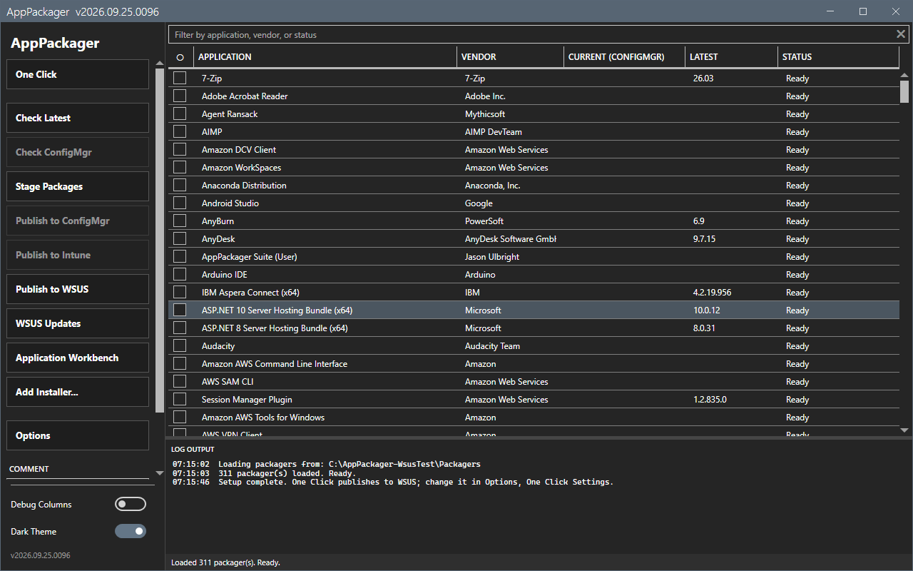
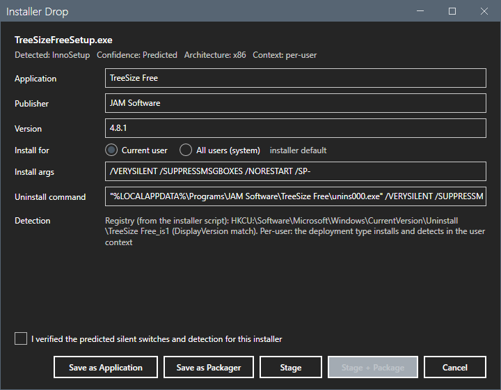
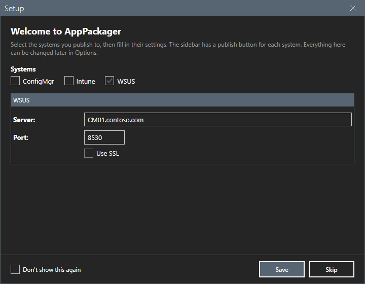
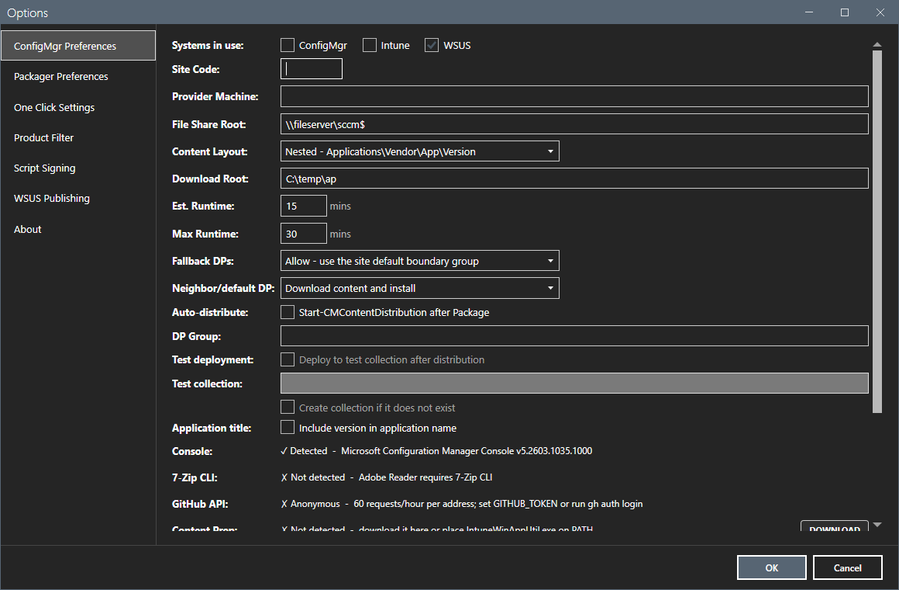
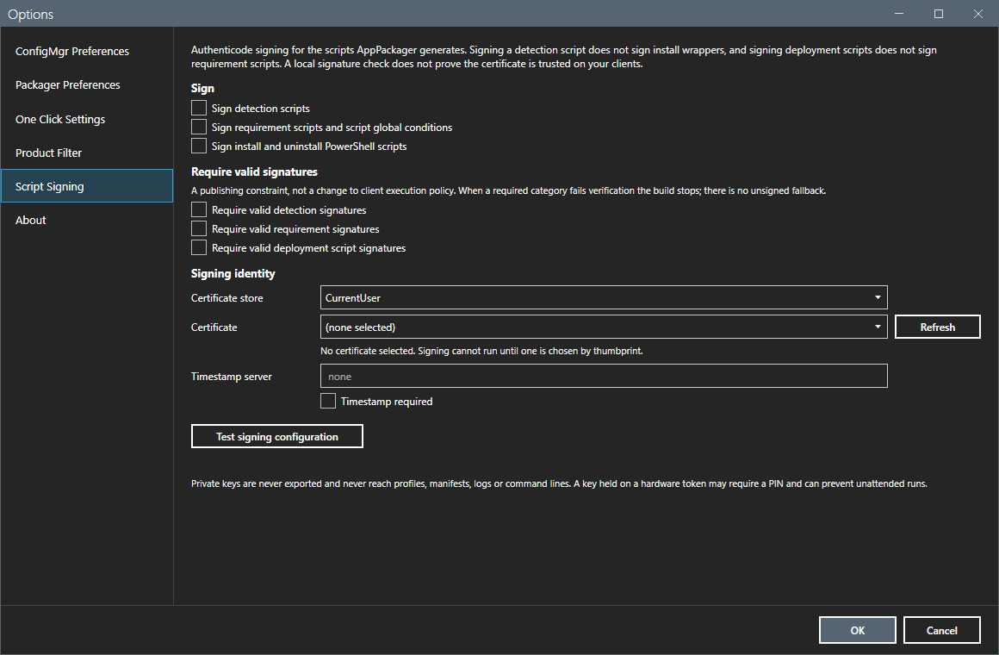
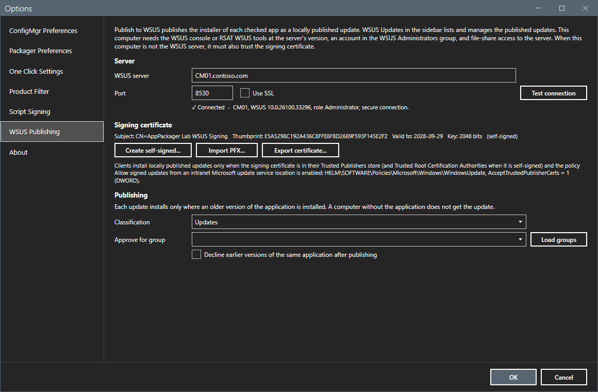
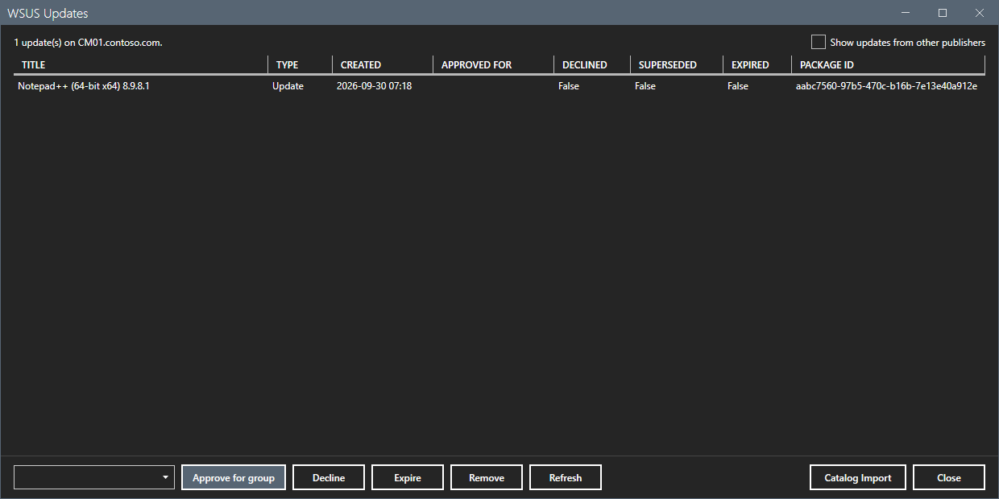
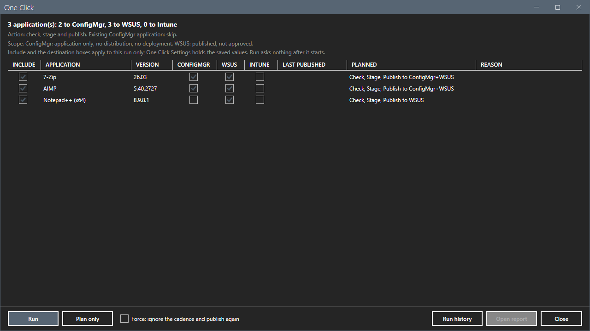
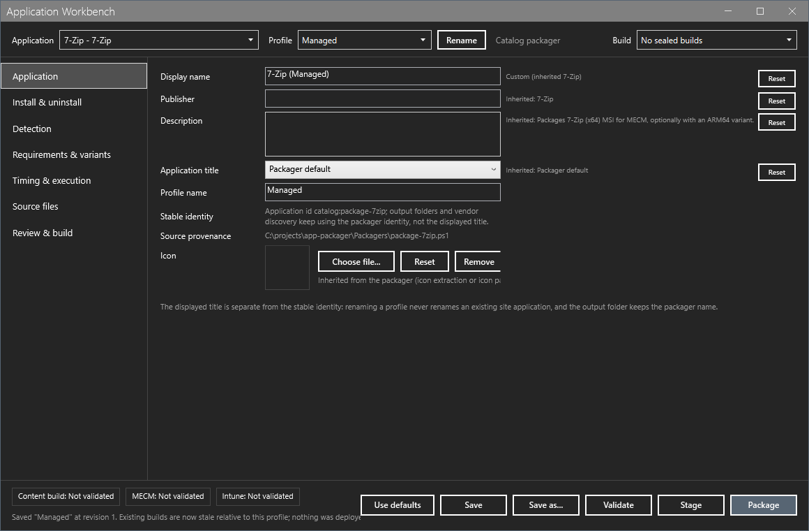

# AppPackager

[](https://github.com/jasonulbright/app-packager/releases/latest)
[](https://github.com/jasonulbright/app-packager/releases)
[](#prerequisites)
[](LICENSE)

Automated application packaging for Microsoft Configuration Manager (ConfigMgr) and Intune: 311 enterprise applications, each one click from vendor download to deployed app. AppPackager checks the vendor for the latest version, downloads and verifies the installer, generates silent install/uninstall wrappers and detection rules, and creates the ConfigMgr Application — or builds the `.intunewin` and publishes it to Intune via Graph, or publishes the installer to WSUS as a locally published update, no ConfigMgr site required. Drag any unknown `.msi`/`.exe` onto the window and it analyzes and packages that too. A companion version monitor flags stale deployments and looks up their CVEs. Built entirely in PowerShell 5.1 — the version that ships in the box on every supported Windows release, oldest to newest. Nothing to install, no add-ons, no agents, no subscription.

This is the class of work commercial third-party patching catalogs sell as a subscription. AppPackager covers a comparable application set — the coverage decision for each of 933 reviewed catalog entries is documented in [CATALOG-PARITY.csv](CATALOG-PARITY.csv) — runs entirely inside your environment, and is MIT-licensed.

## Install

From a PowerShell prompt:

```powershell
curl.exe -Lso "$env:TEMP\ap.zip" https://github.com/jasonulbright/app-packager/releases/latest/download/AppPackager.zip; Expand-Archive "$env:TEMP\ap.zip" "$env:TEMP\ap-setup" -Force; & "$env:TEMP\ap-setup\install.ps1" -ZipPath "$env:TEMP\ap.zip"
```

From cmd.exe (`;` is not a command separator there, so the PowerShell line fails with a curl "-Force is badly used" error):

```bat
curl.exe -Lso "%TEMP%\ap.zip" https://github.com/jasonulbright/app-packager/releases/latest/download/AppPackager.zip && powershell -NoProfile -ExecutionPolicy Bypass -Command "Expand-Archive $env:TEMP\ap.zip $env:TEMP\ap-setup -Force; & $env:TEMP\ap-setup\install.ps1 -ZipPath $env:TEMP\ap.zip"
```

Installs the latest release into `%LOCALAPPDATA%\AppPackager`. Only a zip crosses the wire: content filters commonly block `.ps1` (and sometimes `.txt`) downloads outright while allowing archives, so the bootstrap downloads the release zip through `curl.exe` and runs the installer from inside it against the same zip — no script file is ever fetched over the network, and curl downloads carry no Mark-of-the-Web. Drop a `checksums.txt` beside the zip to have the install verified; without one it proceeds and says so.

On an unrestricted network, the installer can do the whole flow itself — resolve the release from the GitHub API, download, verify SHA-256, extract:

```powershell
curl.exe -Lso "$env:TEMP\ap.zip" https://github.com/jasonulbright/app-packager/releases/latest/download/AppPackager.zip; Expand-Archive "$env:TEMP\ap.zip" "$env:TEMP\ap-setup" -Force; & "$env:TEMP\ap-setup\install.ps1" -InstallPath 'D:\Tools\AppPackager' -Version 2026.09.30.0100
```

Omitting `-ZipPath` makes it download and checksum-verify the requested release; `-InstallPath` picks the folder and `-Version` pins a release. `-Force` is required to replace a non-empty folder that holds no existing AppPackager install. If even the curl download is blocked, fetch the zip in a browser and run the same `-ZipPath` command against it.

Application icons are not part of the install. `Packagers\Icons\` is created on demand from the Options window — see [Application Icons](#application-icons).

## Updating

Re-running `install.ps1` against an existing install performs an in-place update. Everything the application persists inside its own folder — `AppPackager.preferences.json`, `AppPackager.windowstate.json`, `Packagers\packager-preferences.json`, the per-packager config JSONs, and the `Logs` folder — is moved aside, the folder is replaced with the new release, and the state is restored. Files from the old version that no longer ship are removed rather than left behind.

The GUI checks for updates itself: once per day, in the background, at launch. When a newer release exists it logs a line and shows an **Update available: vX.Y.Z.W** link at the bottom of the sidebar that opens the release page, alongside an **Update now** button that runs the same bootstrapper against the current folder and relaunches the application. A failed or unreachable check is logged and otherwise ignored — it never delays or blocks launch. The last check result is cached in `%LOCALAPPDATA%\AppPackager\update-check.json`.

## What It Does

Each packager script operates in two phases:

**Stage** — Downloads the latest installer from the vendor's official source, extracts metadata (version, publisher, detection info), generates install/uninstall wrapper scripts, and writes a `stage-manifest.json`. Everything is built locally under a configurable download root. No network share or ConfigMgr site required. When IntuneWinAppUtil is detected, Stage also builds a `.intunewin` beside the content.

**Package** — Reads the stage manifest, copies the content folder to a versioned UNC network share, and creates a ConfigMgr Application with the appropriate deployment type and detection method. In the GUI, **Publish to ConfigMgr** runs this phase. **Publish to Intune** builds a `.intunewin` from the staged content and publishes it to Intune as a Win32 app via Microsoft Graph. **Publish to WSUS** publishes the staged vendor installer to WSUS as a locally published update. Neither of those two needs a site connection, a file share, or the ConfigMgr console. See [WSUS Publishing](#wsus-publishing).

The GUI (`start-apppackager.ps1`) provides a visual front-end that discovers packager scripts automatically, lets you check latest versions, query ConfigMgr for current versions, and stage or publish selected applications.

**Drop to package** — Drag an `.msi` or `.exe` installer onto the window (or use the sidebar **Add Installer...** button — a drag from Explorer is silently blocked when the two processes run at different elevation levels) and the app analyzes it (engine detection, MSI property tables, silent-switch prediction), opens an editable manifest preview, and stages or packages it through the same manifest pipeline the packager scripts use. MSI identity is authoritative; for other installers the predicted values must be explicitly confirmed before Stage + Package enables. A dropped installer that turns out to be a recurring need can be saved as a starter packager script generated from the matching template, with identity, folders, and filename pre-filled and the download source left as the one remaining TODO.

For an NSIS installer the analysis reads the compiled script inside the file rather than guessing: the install directory, the uninstaller the script writes, the Add/Remove Programs key with its hive and 32/64-bit registry view, and the manifest's requested execution level. The uninstall command comes out as a real path (`"%LOCALAPPDATA%\App\Uninstall.exe" /S`), the detection rule targets the key the script actually writes (under `WOW6432Node` when a 32-bit installer never calls `SetRegView 64`), and a per-user installer — HKCU registration, a profile-relative install folder — is staged as an **Install for user** deployment type with HKCU detection, because a system-context run would install into the SYSTEM profile and never satisfy the detection. For an Inno Setup installer the compiled `[Setup]` header is read the same way: the ARP key is the real `<AppId>_is1` (GUID or name), `DisplayVersion` is the compiled `AppVersion` even when the stub has no file version, the install folder follows `DefaultDirName` and the 64-bit install mode, the uninstall command names `unins000.exe`, and `PrivilegesRequired=lowest` is what makes a setup per-user; an Inno Setup 6 stub is `asInvoker` and elevates itself, so its manifest alone says nothing about the context. An installer that accepts a mode switch (NSIS `/allusers` in electron-builder and MultiUser scripts, Inno Setup `/ALLUSERS` when `PrivilegesRequiredOverridesAllowed` includes the command line) gets an **Install for** toggle in the preview: the default is what the installer does without the switch, and choosing the other mode replaces the install arguments, uninstall command, install folder, detection key and hive, and deployment context together from that branch, so a per-machine deployment is never paired with a per-user uninstall or detection.

**Application Workbench** — fine-tune any packager from a window instead of its script: commands, hook scripts, detection, requirements, runtime, icon and extra files, saved as named profiles that survive updates. See [Application Workbench](#application-workbench).

**Script signing** — sign the detection, requirement and install/uninstall scripts AppPackager stages with your own certificate, and refuse to publish anything that fails verification. See [Script Signing](#options-window) and [Code Signing Certificates](#code-signing-certificates).

**WSUS publishing** — publish the vendor installer to WSUS as a locally published update for computers that have an older version, with applicability rules mapped from its detection; approve, decline, expire or remove published updates; and import Microsoft Update Catalog updates by ID. See [WSUS Publishing](#wsus-publishing).





## Prerequisites

| Requirement | Details |
|---|---|
| **OS** | Windows 10/11 or Windows Server 2016+ |
| **PowerShell** | 5.1 (ships with Windows) |
| **.NET Framework** | 4.7.2 or later (4.8 recommended; required by WPF GUI and MahApps.Metro) |
| **ConfigMgr Console** | Installed locally — provides `ConfigurationManager.psd1` (Package phase only) |
| **ConfigMgr Permissions** | RBAC rights to create Applications and Deployment Types (Package phase only) |
| **Local Admin** | Required for packager script execution |
| **7-Zip CLI** | Required by Adobe Reader for installer extraction. Detected at launch and shown in ConfigMgr Preferences; the detected `7z.exe` path is forwarded automatically to packagers, including non-default install locations. |
| **Network Share** | Write access to the SCCM content share, e.g., `\\fileserver\sccm$` (Package phase only) |
| **WSUS console** | WSUS targets only: the WSUS console or RSAT WSUS tools at the server's version (`Add-WindowsCapability -Online -Name Rsat.WSUS.Tools~~~~0.0.1.0` on Windows 10/11) |
| **WSUS permissions** | WSUS targets only: membership in the WSUS Administrators group on the WSUS server |

## Code Signing Certificates

AppPackager uses a code-signing certificate in two places, and each place has its own requirements. Both features are off until you configure them.

### Script signing certificate

Options > Script Signing signs the detection, requirement, and install/uninstall scripts that AppPackager stages. Signing runs on the computer that runs AppPackager.

| Requirement | Details |
|---|---|
| Enhanced key usage | Code Signing (`1.3.6.1.5.5.7.3.3`) |
| Store | `Cert:\CurrentUser\My` (default) or `Cert:\LocalMachine\My` on the packaging computer. AppPackager selects the certificate by thumbprint only. |
| Private key | Present and usable by the account that runs AppPackager. The key never leaves the store. A key that needs a PIN or a hardware token can stop an unattended run. |
| Validity | Current. An expired or not-yet-valid certificate stops a signed build. |
| Hash | SHA-256 |
| Time stamp | Optional. A time-stamped signature stays valid after the certificate expires. **Timestamp required** stops the build when no time stamp is produced. |
| Client trust | Clients need the certificate in **Trusted Publishers** and its issuing root in **Trusted Root Certification Authorities**, both in the local computer store. The client's PowerShell execution policy decides whether a signed script runs. |

### WSUS signing certificate

WSUS signs every update that AppPackager publishes. The WSUS server signs with the certificate in its own **WSUS** certificate store. Set that certificate in Options > WSUS Publishing with **Import PFX** or **Create self-signed**.

| Requirement | Details |
|---|---|
| Usage | Code Signing enhanced key usage (`1.3.6.1.5.5.7.3.3`) and the Digital Signature key usage |
| Key | RSA, 2048 bits or more. AppPackager refuses a smaller key. Clients reject update signatures from keys under 1024 bits (error `0x80096004`). |
| Private key | Exportable. **Import PFX** reads a PFX file that holds the private key and sends it to the server. A key on a smart card, a hardware token, an HSM, or a cloud signing service cannot be used. |
| Import connection | The PFX and its password travel inside the WSUS API call. AppPackager imports a PFX only when the WSUS API reports a secure connection, for example an SSL connection. |
| Validity | Current. Publishing stops when the certificate has expired. |
| Self-signed | **Create self-signed** asks the server to create the certificate. WSUS on Windows Server 2012 R2 and later does this only when `HKLM\SOFTWARE\Microsoft\Update Services\Server\Setup\EnableSelfSignedCertificates` = 1 (DWORD). Microsoft treats this path as deprecated. Use a certificate from your PKI in production. |
| Client trust | Clients need the certificate in **Trusted Publishers**, and also in **Trusted Root Certification Authorities** when it is self-signed (local computer stores). Clients also need the policy **Allow signed updates from an intranet Microsoft update service location**: `HKLM\SOFTWARE\Policies\Microsoft\Windows\WindowsUpdate`, `AcceptTrustedPublisherCerts` = 1 (DWORD). |
| Publishing computer | When AppPackager does not run on the WSUS server, that computer must trust the certificate the same way. Without that trust, publishing fails with "Verification of file signature failed". |
| Configuration Manager | When Configuration Manager manages the certificate for third-party updates, keep it in charge. A certificate set from AppPackager replaces it. |

**Export certificate** saves the public certificate (`.cer`). Distribute it by Group Policy (Computer Configuration > Policies > Windows Settings > Security Settings > Public Key Policies), or run these commands elevated on each client:

```powershell
Import-Certificate -FilePath .\wsus-signing.cer -CertStoreLocation Cert:\LocalMachine\TrustedPublisher
Import-Certificate -FilePath .\wsus-signing.cer -CertStoreLocation Cert:\LocalMachine\Root   # self-signed only
```

### One certificate for both

One certificate can do both jobs when it meets both tables: Code Signing usage, RSA 2048 bits or more, and an exportable private key. A client that already trusts it for scripts then also accepts the WSUS updates, once the policy above is set.

A separate certificate for WSUS is safer. **Import PFX** puts the private key on the WSUS server. Every WSUS administrator can then publish content that clients run as SYSTEM, and a compromised WSUS server exposes a key that also signs scripts for every client. Issue a second certificate from the same template instead.

Updates imported from the Microsoft Update Catalog need no certificate from you: Microsoft signs them.

## Usage

### GUI

Launch the WPF front-end:

```powershell
.\start-apppackager.ps1
```

Or with custom parameters:

```powershell
.\start-apppackager.ps1 -SiteCode "MCM" -PackagersRoot "D:\CM\Packagers"
```

**No network or ConfigMgr actions occur on launch.** The GUI loads packager scripts locally (pre-populating the Latest and Last Checked columns from any persistent history) and waits for you to act.



**First-run setup** — on a machine with no `AppPackager.preferences.json` yet, a themed Setup window opens over the main window once the grid has loaded. It asks which systems you publish to (ConfigMgr, Intune, WSUS, in any combination) and then shows only the settings those systems need: Site Code, Provider Machine, File Share Root, and Download Root for ConfigMgr, Tenant ID, Client ID, and Client Secret for Intune, and the WSUS server, port and SSL choice for WSUS. The selection is saved as **Systems in use** (Options, ConfigMgr Preferences): the sidebar buttons of a system that is not in use stay disabled, whatever else is set, and a version check runs without a site code when ConfigMgr is not in use. Every selected system becomes a default One Click destination; change that in One Click Settings. Saving writes the same preference keys the Options window writes — the client secret DPAPI-protected for the current Windows user, an empty secret box keeping any saved one — and the main window picks the settings up without a restart. A "Don't show this again" checkbox lets you dismiss the wizard permanently without configuring anything; skipping or closing it without that box ticked brings it back on the next launch. Existing installs are unaffected: a preferences file from an earlier version counts as already set up.

The sidebar has the workflow actions at the top, an **Add Installer...** button that feeds the drop-to-package intake, a single **Options** button below them, a sidebar comment field, and Debug Columns / theme toggles plus the installed version at the bottom:

- **One Click** — opens the plan for the apps you track in One Click Settings, then runs Check Latest → Stage → Publish per destination without a prompt. See [One Click](#one-click). Multi-app loops (Check Latest, Stage, Package, One Click) run on a background STA runspace with an animated progress overlay so the window stays responsive instead of freezing during long downloads / extracts / ConfigMgr round-trips
- **Check Latest** — queries vendor sources for the latest version of selected applications
- **Check ConfigMgr** — queries your ConfigMgr site for the currently deployed version
- **Stage Packages** — downloads installers, extracts metadata, generates wrappers and manifests locally, and builds a `.intunewin` when IntuneWinAppUtil is detected
- **Publish to ConfigMgr** — reads manifests, copies content to network share, creates ConfigMgr applications
- **Publish to Intune** — stages each checked app, builds its `.intunewin`, and publishes a Win32 app through Microsoft Graph
- **Publish to WSUS** — stages each checked app and publishes its installer to WSUS as an update for computers that have an older version
- **WSUS Updates** — lists the updates AppPackager published to WSUS; approve, decline, expire or remove them, or import from the Microsoft Update Catalog

Each publish button sends the checked apps to its own destination, so the destination is chosen per run. A button whose system is not in use (Systems in use, set in Setup or Options) or not configured is disabled, and its tooltip says what to set: the ConfigMgr console and a site code for ConfigMgr, Tenant ID, Client ID and Client Secret for Intune, and a WSUS server for WSUS.

All workflow actions share the same persistent history file at `%LOCALAPPDATA%\AppPackager\app-history.json`, so Latest Version and Last Checked survive across sessions.

### Options window

Clicking **Options** opens a unified settings window with a left-nav list and a right content pane (Discord / VS Code style). A single OK commits every panel's changes in one action, and Cancel discards them all.



**ConfigMgr Preferences** — Site Code, Provider Machine, File Share Root, Content Layout, Download Root, estimated/maximum deployment runtime, an Auto-distribute-to-DP checkbox + DP Group Name, and a test-deployment group (Deploy to test collection, Test collection name, Create collection if it does not exist). Content Layout selects the share folder shape for packaged content: **Nested** (`Applications\Vendor\App\Version`, the default — an app's versions sit adjacent, so retention pruning is deleting old version folders in place) or **Flat** (`Applications\Vendor-App-Version`, one folder per package, for org conventions that mandate it). It applies to future Package runs; existing content stays where it is, so pick one and stay with it — mixing layouts splits content across two trees. Provider Machine is the `$ProviderMachineName` value from the ConfigMgr AdminUI-generated connect script. The bottom of the panel shows detected-tools status: ConfigMgr Console (name, version, install path in tooltip), 7-Zip CLI (display name, version, exe path), GitHub API (Authenticated with the token source and remaining hourly quota, or Anonymous at 60 requests/hour; see [Vendor Version Monitor](#vendor-version-monitor)), Content Prep (IntuneWinAppUtil.exe version and path, with a Download button when missing), and Icon Pack (installed pack version and icon count, with a Download packager icon pack button — see [Application Icons](#application-icons)). Each row shows a checkmark + version when found or an `X` + guidance when missing.

Two settings control the content options of each ConfigMgr deployment type that a Package run creates. **Fallback DPs** maps to `-ContentFallback`: **Allow** (the default) lets a client use distribution points in the site default boundary group when no distribution point in its current or neighbor boundary groups has the content; **Deny** keeps the client on its current and neighbor boundary groups. **Neighbor/default DP** maps to `-SlowNetworkDeploymentMode` and sets the deployment option when the client uses a distribution point in a neighbor boundary group or the site default boundary group: **Download content and install** (`Download`, the default) or **Do not download content** (`DoNothing`). Both settings apply to future Package runs; existing deployment types keep their settings. Intune publishing does not use them.

When Auto-distribute is enabled and DP Group Name is populated, every Package phase (manual or One Click) calls `Start-CMContentDistribution -ApplicationName <app> -DistributionPointGroupName <group>` after creating the ConfigMgr Application. "Already been targeted" is silently treated as success so re-packaging is idempotent.

The test-deployment controls unlock only when Auto-distribute is on and a DP Group is set (the gating lives in the GUI — without content on a DP a test deployment could never install). When enabled with a collection name, the Package phase follows content distribution with `New-CMApplicationDeployment -Name <app> -CollectionName <collection> -DeployAction Install -DeployPurpose Available -AvailableDateTime (Get-Date)` — Available, immediately, default options. With "Create collection if it does not exist" checked, a missing collection is created as an empty direct-membership device collection limited to All Systems; otherwise a missing collection logs a warning and the deployment is skipped. An already-existing deployment is treated as success so re-packaging stays idempotent.

**Publish to Intune** stages the app, builds the `.intunewin`, and publishes it through Graph, with no site connection, file share, or console requirement; ConfigMgr-specific features like deployment conditions, variant splits, auto-distribute, and test deployment do not apply. Intune publishing needs an Entra app registration with `DeviceManagementApps.ReadWrite.All`; Tenant ID, Client ID, and Client Secret live in ConfigMgr Preferences with the secret DPAPI-protected for the current Windows user. Repeat publishes update the existing Intune app (new content version on the same identity) instead of creating duplicates; detection rules are mapped from the stage manifest, and assignment stays with the operator in the Intune console.

Stage builds `<app>-<version>.intunewin` from the staged content (setup reference: `install.bat`) beside the local staged version folder. **Publish to ConfigMgr** copies that file beside the network content version folder, and builds it first when the stage has none. The artifact is written beside the version folders, never inside them, so stage hash verification is unaffected. Prep failures log a warning and never fail the run. The step runs once IntuneWinAppUtil.exe is detected: the Content Prep row checks the stored preferences path, `%LOCALAPPDATA%\AppPackager\Tools`, and PATH once per launch, and its Download button fetches the Microsoft Win32 Content Prep Tool from Microsoft's repository, keeping the file only after its Authenticode signature verifies as Valid and Microsoft-signed. The tool is never redistributed with AppPackager.

ConfigMgr Console detection runs once per launch. It scans the registry ARP entries for "Configuration Manager Console", then falls back to `$env:SMS_ADMIN_UI_PATH` and known install paths to locate `ConfigurationManager.psd1`. Check ConfigMgr, Publish to ConfigMgr, and One Click with Stage and Publish to ConfigMgr create the missing `CMSite` PSDrive with `New-PSDrive -PSProvider CMSite -Root <Provider Machine>`, matching the AdminUI connect prompt, then show a themed "Console Required" warning and bail when the module can't be found on the workstation.

**Packager Preferences** — grouped settings that packagers read at Stage time:

- **M365: ODT Settings** — Company Name, M365 Channel, M365 Deploy Mode, and a checkbox grid of `ExcludeApp` entries (Groove, Lync, OneDrive, Teams, Bing, etc.). Selected excludes are written into the generated ODT `install.xml` as `<ExcludeApp ID="…" />` entries. Each checkbox has a tooltip documenting what that app ID represents.
- **SSMS: Silent Install Options** — quiet/passive UI mode, download-before-install, installer self-update behavior, recommended/optional component toggles, remove-OOS, force-close, and optional custom install path. Each option has a tooltip and is consumed by the SSMS packager at Stage time.
- **DBeaver Community** — Install Scope (System installs machine-wide to `C:\Program Files\DBeaver` with `/allusers`; User installs to `%LOCALAPPDATA%\DBeaver` with `/currentuser`, needs no elevation, and drives a per-user uninstall command and detection path) and a Disable AI features toggle that appends `-Dai.disabled=true` to the installed `dbeaver.ini` after install. The DBeaver packager also takes `-InstallScope` and `-DisableAI` directly, overriding these stored values.
- **Adobe Acrobat Reader** — Edition (English downloads the `en_US` installer; Multilingual downloads Adobe's MUI installer) and, for Multilingual, the languages to install: a list of Adobe locale codes or **All languages**. English is always installed, and the Reader UI follows the language of the operating system (`LANG_LIST`, `SUPPRESSLANGSELECTION=1` through `setup.ini`). A MUI base takes the MUI update patch. Detection and the application name do not change with the edition. To see the installed languages on a client, read `UserLangList` under `HKLM\SOFTWARE\WOW6432Node\Adobe\Acrobat Reader\DC\Installer` (for example `de_DE,en_US,fr_FR`), or list `Reader\Locale` in the install folder. The `<LANG>_GUID` values in the same key list every language, installed or not.
- **Beyond Compare 5** — License Key File, chosen with a file browser. Stage places it beside the installer as `BC5Key.txt`, where setup reads it to register the product. Stage and Package stop when no key file is available. The packager also takes `-KeyFile` directly, overriding the stored path.
- **TeamViewer Host** — API Token, Custom Configuration ID, Assignment Options, and a toggle for removing the desktop shortcut at install. Values are passed through the generated EXE install wrapper to TeamViewer Host's documented mass-deployment switches.
- **Citrix Workspace App** — full install-switch coverage (Store Configuration, Installation Options, Plugins/Add-ons, Update/Telemetry, Store Policy, Components). Applied during Stage for both CR and LTSR packagers.
- **Local Installer Sources** — one folder per packager that can use an installer you download yourself. Stage uses the highest file version in the folder. Packagers that have no public download ask for the folder at Stage when it is not set. The packager also takes `-SourceFolder` directly, overriding the stored folder.

Two themed preview buttons at the top-right of the panel:
- **CWA Preview** shows the assembled `CitrixWorkspaceApp.exe …` command line for the current switch selection.
- **M365 Preview** shows the generated ODT `install.xml` for all four M365 SKU variants (Apps x64/x86, Project x64, Visio x64) using the live Channel, Company Name, and ExcludeApp selection. Both preview windows use the app's theme, a monospaced font, and a Copy button.

M365 Deploy Mode controls how Office 365 products are staged and detected:
- **Managed (Offline)** — downloads the full Office source (~2.3 GB per product), pins a specific version, uses file version detection. Requires monthly repackaging to stay current.
- **Online (CDN)** — stages only the ODT setup.exe and config XML (~7 MB). Endpoints pull the latest version directly from the Office CDN at install time. Detection is existence-only. Deploy once, never repackage.

CWA switches persist to `Packagers/citrix-workspace-switches.json`; TeamViewer Host config persists to `Packagers/teamviewer-host-config.json`; packager-facing M365, CompanyName, SSMS, DBeaver, and Beyond Compare 5 values are mirrored to `Packagers/packager-preferences.json`. GUI preferences persist to `AppPackager.preferences.json`.

**One Click Settings** — configures the **One Click** sidebar button. Pick which packagers the tracked set includes (Track column), choose the action (Report only / Stage / Stage and Publish), set the default destinations (ConfigMgr, WSUS, Intune) and, per row, the destinations of an app that differs from the default. A row with no destination box checked is skipped. Choose what a run does with a ConfigMgr application that already exists (skip or overwrite; a run never asks), toggle Force on launch (bypasses cadence and the duplicate guard), and set per-app cadence overrides in the grid. Tracked apps and their settings persist to `AppPackager.preferences.json`. Default cadence for each packager is read from its `UpdateCadenceDays:` header tag (falling back to 7 days); per-app overrides in this dialog take precedence.

**Product Filter** — show or hide individual packager scripts in the main grid, grouped by vendor in a checkbox TreeView with Select All / Select None helpers. Hidden applications persist to `AppPackager.preferences.json`. On the first Check ConfigMgr run, the tool offers to auto-hide applications not found in your ConfigMgr environment.

**Deployment Conditions** — requirement rules are optional and off for every application until you add one in the [Application Workbench](#application-workbench) under Requirements & variants. The client evaluates them at deployment evaluation time, so no collections are involved. Three site conditions ship, matched by name so a condition your site already has is reused; their names and the VPN adapter patterns are edited in that same section and persist to `Packagers/condition-templates.json`:

- **Architecture** — `Any` / `x64 only` / `ARM64 only`, backed by a WQL global condition on `Win32_Processor.Architecture` (9 = x64, 12 = ARM64). The numeric property compares identically on every OS language, and unlike the OS-platform requirement list it needs no update when a new Windows version releases.
- **OS languages** — comma-separated culture codes (e.g. `de-DE, en-US`) mapped onto the site's built-in Operating System Language condition with a OneOf rule. Useful when a packaged build is single-language and MUI or English builds are deployed separately.
- **Network** — `Any` / `VPN only` / `On-site only`, backed by a Boolean script global condition that reports whether an IP-enabled adapter description matches a configurable VPN client pattern list (or an interface alias contains `vpn`). `VPN only` suits a small CDN-sourced deployment that should avoid pulling large content over the tunnel; `On-site only` suits its full-content counterpart.

Before copying content or changing ConfigMgr, Publish to ConfigMgr checks the exact application title and asks **Overwrite**, **Skip**, or **Cancel run** if it already exists, even at a different version. One Click applies the policy saved in One Click Settings instead of asking. Overwrite replaces deployment types while keeping the application and its deployments. Skip leaves it unchanged; Cancel stops the remaining run. **Do this for all remaining conflicts** applies only to the current run.

**Script Signing** — Authenticode signing for the scripts AppPackager stages.



- Sign detection scripts, requirement scripts and install/uninstall scripts independently. A require switch fails the run instead of publishing unsigned content.
- Certificate by thumbprint from `CurrentUser\My` or `LocalMachine\My`, optional timestamp server, and a test button that signs and verifies a temporary file.
- Signed launchers drop `-ExecutionPolicy Bypass`. The client's execution policy and Trusted Publishers store decide whether a script runs, so the certificate has to reach the clients.
- Vendor scripts that already carry an intact signature are left alone; unsigned ones are signed with your certificate. A PSADT package enters through its `.ps1`, not its `.exe`.
- Certificate requirements: see [Code Signing Certificates](#code-signing-certificates).

**WSUS Publishing** — the WSUS server, the signing certificate, and publish defaults. The published updates and the catalog import are in **WSUS Updates** in the sidebar. See [WSUS Publishing](#wsus-publishing).

**About** — application name, installed version (parsed from the script header, the single source of truth), MIT license, a clickable link to the GitHub repository, the timestamp of the last update check, and the latest known release. The same **Update now** action offered in the sidebar is repeated here, enabled only once a check has actually found a newer release; a **Release notes** button opens the releases page.

### WSUS Publishing

Configure **Options > WSUS Publishing**, check the apps, and click **Publish to WSUS**. Each app is staged, and its vendor installer is published to WSUS as a locally published update. An app that WSUS cannot carry shows **WSUS: not supported** in the Status column, and the log names the reason. One Click publishes to WSUS for every row whose WSUS box is checked; a ConfigMgr application that already exists and is skipped does not stop the WSUS publish.

WSUS publishing updates installed applications only. WSUS offers an update only to a computer where the detection finds the application with an older version. A computer without the application never gets the update. Use a ConfigMgr or Intune deployment for a first installation.

Microsoft runtimes:

| Packager | WSUS result |
|---|---|
| package-aspnethostingbundle8.ps1, package-aspnethostingbundle10.ps1 | Publishes. The update reads the hosting bundle's own Add/Remove Programs entry: its name and its version. |
| package-msvcruntimesx64.ps1, package-msvcruntimesx86.ps1 | Publishes. The update compares the file version of `vcruntime140.dll` in `System32` (x64) or `SysWOW64` (x86). |
| package-msvcruntimes.ps1 | Stops: its `install.ps1` starts two installers. Use the x64 and x86 packagers for WSUS. |

A newer .NET runtime of the same major, for example the Windows Desktop Runtime, raises the shared .NET host, but it does not hide an older hosting bundle. The ConfigMgr and Intune detection script and the WSUS rules read the same entry: the hosting bundle's own Add/Remove Programs entry.

Requirements on the computer that runs AppPackager:

- Windows PowerShell 5.1. The WSUS administration API does not load in PowerShell 7.
- The WSUS console at the server's version: the optional feature **RSAT: Windows Server Update Services Tools** on Windows 10 or 11, or `Install-WindowsFeature UpdateServices-UI` on Windows Server.
- An account in the **WSUS Administrators** group on the server.
- Network access to the server's API port (8530 for HTTP, 8531 for HTTPS by default) and to its `UpdateServicesPackages` and `WSUSTemp` shares.
- A WSUS signing certificate that this computer trusts when it is not the WSUS server. See [Code Signing Certificates](#code-signing-certificates).
- A patched WSUS server. CVE-2025-59287 is a critical remote code execution vulnerability in WSUS; install the October 2025 WSUS security update or later before you expose ports 8530 and 8531.

Requirements on clients: they get updates from the WSUS server, they trust the signing certificate, and they have the **Allow signed updates from an intranet Microsoft update service location** policy (see [WSUS signing certificate](#wsus-signing-certificate)). If clients use **Specify source service for specific classes of Windows Updates**, confirm that the source for Other Updates is Windows Server Update Services.

| Setting | Effect |
|---|---|
| WSUS server, Port, Use SSL | The API endpoint of the server. The port follows Use SSL (8530 or 8531) until you type another one. SSL is recommended, and a PFX import requires a secure connection. |
| Classification | The WSUS classification of every published update. |
| Approve for group | Approves each new update for this computer group. Leave it empty to approve later from **WSUS Updates**: the WSUS console does not list locally published updates. |
| Decline earlier versions | Declines the AppPackager updates of the same application that have a lower version. |

**Test connection** shows the server version, the account role, whether the connection is secure, and the signing certificate. **Create self-signed**, **Import PFX**, and **Export certificate** manage the signing certificate. **Load groups** reads the computer groups for the approval box.

A publish runs these steps:

1. It checks the manifest before it contacts the server. It stops, with the reason, for a variant set, an MSIX or Office Deployment Tool package, a per-user or interactive install, a custom install command or script, an `install.ps1` that does more than start the installer, staged files in a subfolder, a detection that step 4 cannot map to rules, or a payload larger than 2047 MB. The row then shows **WSUS: not supported**.
2. It verifies every payload file against the SHA-256 that Stage recorded.
3. It builds the update from the staged files and the manifest's silent arguments. The update carries every file that Stage recorded, except the files that AppPackager generates: the install and uninstall scripts, the icon, and the detection and requirement scripts. An MSI receives only its `PROPERTY=value` arguments, and `/norestart` becomes `REBOOT=ReallySuppress`. An EXE maps exit codes 0 and 1707 to success, and 3010 and 1641 to success with a restart.
4. It maps the detection to applicability rules. The update counts as installed when the rules find this version or a newer one. WSUS offers the update only when the rules find the application with an older version. The rules come from the first source that applies:
   - A WsusDetection block in the packager. It names the product's Add/Remove Programs entry (publisher, name, version) for WSUS only. ConfigMgr and Intune keep the detection.
   - The detection, when it compares a version: a file version, or a registry value under a key that every version uses.
   - For an MSI installer, the Add/Remove Programs entry that the MSI registers: its name, publisher, version, and the Windows Installer flag, so that a copy of the product installed by another installer does not match. The `WSUS publish:` line in the log names this entry.

   When no source applies, the publish stops. Examples: an EXE whose detection only checks that a file or key exists, compares text, reads a per-version Windows Installer product key, runs a script, or reads a per-user location.
5. Each new update gets its own ID. A repeat publish of the same version finds the existing update by its identity line (application, profile, version), unless that update is expired. It then applies the approval and the decline of earlier versions again, unless the update is declined on the server.
6. It lists the AppPackager updates of the same application that have a lower version as superseded. An update with a higher version stays as it is.
7. A failed approval or decline does not undo the publish. The row shows **Published, warning** (**Packaged, WSUS warning** after a One Click ConfigMgr + WSUS run), and the log names the failure.

Every update goes under the vendor **AppPackager** and the product **AppPackager Applications**. One category keeps the server under its limit of locally published categories. With Configuration Manager, select that product in the software update point's Products list and the chosen classification in its Classifications list, then synchronize software updates. WSUS removes the category with the last AppPackager update and creates it again, with the same ID, at the next publish. Configuration Manager keeps the product selected. Until the next publish, each synchronization writes `Requested category not found` for the product to `wsyncmgr.log`.





**WSUS Updates** in the sidebar lists the updates AppPackager published, with their approvals and state, and acts on the selected updates. **Show updates from other publishers** also lists locally published updates from other tools. An update with the **Type** `Application` comes from an earlier build that could install on computers without the application. A new publish does not supersede or decline it, and the publish log names it. Expire and remove it.

| Action | Effect |
|---|---|
| Approve for group | Approves the update for installation by one computer group. |
| Decline | Removes all approvals; clients are no longer offered the update. Approving again reverses it. |
| Expire | Marks the update expired. Clients stop seeing it, and it cannot be approved again. It cannot be undone. |
| Remove | Declines the update and deletes it from the WSUS database. It cannot be undone. Computers that installed the update keep the software. |

The same actions run from Windows PowerShell 5.1, for example to retire every superseded AppPackager update:

```powershell
Import-Module .\Packagers\AppPackagerWsus.psd1
$wsus = @{ ServerName = 'wsus01.contoso.com'; PortNumber = 8531; UseSsl = $true }
$ids = Get-WsusPublishedUpdates -Settings $wsus | Where-Object { $_.Superseded -and -not $_.Expired } | ForEach-Object { [guid]$_.PackageId }
Set-WsusPublishedUpdateState -Settings $wsus -PackageId $ids -Action Expire
```

Each call returns one result per update, with `Ok` and `Message`.

To retire an update, expire it. To clean up, remove it after that. To publish the same version again, for example after a rules change, expire its update first: the next publish creates a new update with a new ID. With Configuration Manager, let the software update point synchronize between the two steps, so that Configuration Manager also shows the update as expired. WSUS refuses to remove an update that another update still references. Expire such an update instead. After removals, the WSUS Server Cleanup Wizard deletes the update files that are no longer needed.

**Catalog Import**, a button in the WSUS Updates window, imports Microsoft updates that do not synchronize automatically, from update IDs or catalog links. The WSUS server downloads the metadata itself, so it needs internet access.

WSUS publishes the install only. Removal stays with ConfigMgr, Intune, or the vendor uninstaller.

### One Click

One Click is the unattended run: the plan, the run, and the report.



1. **Plan.** The button opens the plan window. One row per tracked application: the version the last check found, the destination boxes (ConfigMgr, WSUS, Intune), the version last published to each destination, the planned steps, and the reason for every skip. The count line reads, for example, `12 application(s), 2 skipped: 9 to ConfigMgr, 4 to WSUS, 0 to Intune`. A line above the grid names a destination that is not ready (not in use, or a setting missing) and the scope of each publish: the DP group and test collection for ConfigMgr, the approval group for WSUS, and that an Intune app is created without an assignment. Include and the destination boxes apply to this run only. **Plan only** writes the plan as a report without running anything.
2. **Run.** The grid becomes the progress grid: the step per row, then the result per destination. Nothing asks during the run: an application that already exists in ConfigMgr follows the policy saved in One Click Settings, and an application without its local source folder is dropped from the run before it starts. A failed application does not stop the next one. The row outcome is Failed when any destination failed, else Published when any destination published, else Not supported when a destination refused, else Skipped. Pause and Cancel stay on the main window.
3. **Report.** Every run writes `Logs\OneClick\one-click-<timestamp>.md` and `.json`: start, end, operator, computer, action, scope, and per application the version, the outcome, the result per destination with its identifier (the ConfigMgr application name, the WSUS package ID, the Intune app ID), and the reason for a skip or a refusal. The Markdown file ends with the rollback pointers. **Open report** opens the last one; **Run history** opens the folder.

The duplicate guard reads the version last published to each destination from `%LOCALAPPDATA%\AppPackager\app-history.json`: a version that a destination already has is not published there again, and a destination checked since the last publish gets the current version without a vendor change. **Force** ignores the guard and the cadence. WSUS still reuses the update it holds for the same version (the result reads `already on the server`); expire that update first to publish the version again. A destination that refused a version (`WSUS: not supported`) is not tried again for that version unless Force is set.
### Application Workbench

Fine-tune any packager without editing its script. Open it from the sidebar, or right-click a row and pick **Edit application...**.



- Every field shows the packager's value as inherited; change it and it becomes a custom value with a per-field reset.
- Install & uninstall: keep the generated command, add before/after scripts, or replace it with your own.
- Detection, requirements, variant overrides, runtime, install context, icon and extra source files.
- Changes save to a named profile per application. **Save** updates the active profile, **Save as** copies it, `default` is the packager as shipped.
- The review pane lists ConfigMgr and Intune findings before you build; Stage and the three Publish buttons run from the window.
- Profiles live under `%LOCALAPPDATA%\AppPackagerData\Workbench`, outside the install folder, so updates never touch them.
- One Click rebuilds an application when its vendor version, profile or signing policy changed.
- The same build runs from the command line through `Invoke-AppPackagerBuild.ps1`, see [Command Line](#command-line).

**Requirements & variants** — attach any of the three site conditions to the application. A **Variant split** is offered where the packager declares `SupportsVariants:` (`Architecture`, `Language`, `Network`): one application, one deployment type per variant, each gated by its own rule with an unconditional fallback last; the selection reaches the packager as `APP_PACKAGER_VARIANTS`. **Install for** (`Default`, `System`, `User`) is offered where the packager declares `SupportsInstallModes:`, meaning the installer takes a mode switch (NSIS `/allusers` and `/currentuser`, Inno Setup `/ALLUSERS` and `/CURRENTUSER`). Choosing the other mode rewrites the staged package from that mode's branch: the switch in the install and uninstall arguments, the uninstaller path, the detection hive, view and folder, and the deployment type's install behavior. The choice reaches the Stage phase as `APP_PACKAGER_INSTALL_MODE`; a Stage that cannot honor it fails instead of staging the wrong mode.

**Install & uninstall** — the install and uninstall command lines the deployment type will carry, against the shipped defaults with a per-field reset. Overrides reach the packager as `APP_PACKAGER_COMMANDS`, are recorded in the stage manifest, and an explicit override always beats the manifest's generated command.

**Application title** — **Packager default**, **Include version** (separate applications per release), or **No version** (one perpetual application, useful for browsers). **Options > ConfigMgr Preferences > Include version in application name** sets the default for every application, and **Remove version from application name** (available while the first box is clear) strips the release version from a vendor product name that carries it, such as 7-Zip 26.03, Slido 2.3.1, or Tableau 2026.2; a per-application choice here overrides both. Versionless updates still ask before overwriting. Content folders and detection remain versioned. Changing the setting does not rename or migrate existing applications or deployments; choose the naming before establishing a perpetual deployment.

Global conditions are created on the site the first time a rule needs them. A signed or changed script condition gets its own name carrying a short content hash, so an existing condition is never rewritten under another application's feet. Requirement resolution fails the run before anything is created when a rule can't be built — a package never silently ships without the rules configured for it.

### Sidebar comment and toggles

The optional **Administrative Comment** field sits in the sidebar below the Options button for per-run entry. **Debug Columns** and **Light Theme** are toggle switches at the sidebar bottom. Window size, position, theme, and debug-column state are persisted automatically across sessions.

### Grid features

- **Filter box** — narrows the grid by application, vendor, status, or CM name as you type
- **Right-click context menu** on any row — Edit application, Open Log Folder, Open Staged Folder, Open Network Share, Copy Latest Version
- **Ctrl+Click** any row to open the vendor's product page in the default browser
- **Row hover tooltips** — hover over any row to see the application's description from the packager script
- **Selection cycle header** — clicking the checkbox column header cycles none → all → updates only → none; selection acts on the rows the filter shows and the glyph reflects the current bulk state
- **Pause / Resume / Cancel** — long multi-app runs can pause after the current app, resume, or cancel without hiding the log drawer
- **Real-time log streaming** — Stage, Package, and One Click stream packager output line-by-line into the log pane as it runs; the UI keeps the newest 4,000 lines while disk logs remain complete
- **Debug Columns toggle** — exposes CMName, Script filename, Vendor URL, and Last Checked (ISO 8601 UTC) columns for deeper inspection
- **Tooltips** on all interactive controls — hover over any field or button for a description of its purpose

### Command Line

Run a packager script directly:

```powershell
# Stage only — download, extract metadata, generate wrappers + manifest
.\Packagers\package-chrome.ps1 -StageOnly

# Package only — read manifest, copy to network, create ConfigMgr app
.\Packagers\package-chrome.ps1 -PackageOnly -SiteCode "MCM" -Comment "Initial deployment" -FileServerPath "\\fileserver\sccm$"

# Both phases in sequence (original behavior)
.\Packagers\package-chrome.ps1 -SiteCode "MCM" -Comment "Initial deployment" -FileServerPath "\\fileserver\sccm$"

# Check the latest available version without downloading or creating a ConfigMgr application
.\Packagers\package-chrome.ps1 -GetLatestVersionOnly
```

Or drive one application through a workbench profile without the GUI:

```powershell
# Stage 7-Zip through the "Managed" profile
.\Invoke-AppPackagerBuild.ps1 -Application catalog:package-7zip -Profile Managed -Stage

# Stage and package with runtime run overrides for this build only
.\Invoke-AppPackagerBuild.ps1 -Application package-git.ps1 -Profile default -Target MECM -Stage -Package -EstimatedMinutes 10 -MaximumMinutes 25

# Stage 7-Zip and publish it to WSUS, approved for the Pilot group
.\Invoke-AppPackagerBuild.ps1 -Application package-7zip.ps1 -Target WSUSOnly -Package -WsusServer wsus01.contoso.com -WsusPort 8531 -WsusUseSsl -WsusApprovalGroup Pilot
```

| Parameter | Description |
|---|---|
| `-Application` | `catalog:package-7zip`, `custom:<script>`, `byo:<id>`, or a packager file name |
| `-Profile` | Profile name or id; `default` (the packager's own behavior) when omitted |
| `-Version` | Package this version instead of the latest |
| `-Target` | `ContentOnly`, `MECM` (default), `MECMAndIntune`, `IntuneOnly`, `MECMAndWSUS`, `WSUSOnly` |
| `-WsusServer` / `-WsusPort` / `-WsusUseSsl` | WSUS server for the WSUS targets. Each value not given comes from the Wsus section of the preferences file. |
| `-WsusClassification` | The WSUS classification of the published update |
| `-WsusApprovalGroup` / `-WsusDeclineSuperseded` | Approve each new update for a computer group; decline the AppPackager updates of the same application that have a lower version |
| `-Stage` / `-Package` | One or both phases; at least one is required |
| `-DownloadRoot` | Local staging root; a non-default profile stages under its own subfolder |
| `-EstimatedMinutes` / `-MaximumMinutes` | Run overrides for this build; never written back to the profile |
| `-PackagersRoot` / `-LogFolder` | Locations, defaulting beside the script |
| `-SiteCode` / `-ProviderMachineName` / `-FileServerPath` | ConfigMgr connection and share, as the packagers take them |
| `-Comment` | Administrative comment stored on the application |

It creates the run snapshot, sets the child environment and launches the packager exactly as the GUI does, so a scheduled build and a button click produce the same content. A WSUS target publishes the manifest staged in the same run, so `MECMAndWSUS` needs `-Stage` and `-Package` together. The result object carries a `Wsus` block. A failed publish sets exit code 1. A failed approval or decline after a successful publish also sets exit code 1, and `Wsus.Warnings` names it. A `custom:` script lives under `<workbench data root>\scripts`, outside the install folder, and must import `AppPackagerCommon.psd1` by its full path; it builds from the command line only, since the main grid lists the `Packagers` folder.

All packager scripts accept the same core parameters:

| Parameter | Description |
|---|---|
| `-SiteCode` | ConfigMgr site code PSDrive name (default: `MCM`) |
| `APP_PACKAGER_CM_PROVIDER` | Optional environment override for the SMS Provider machine used to create a missing `CMSite` PSDrive |
| `APP_PACKAGER_REQUIREMENTS` | Optional environment JSON (`{"SchemaVersion":1,"Rules":[...]}`) of requirement rule specs applied to the deployment type; the GUI sets it per app from the Deployment Conditions panel |
| `APP_PACKAGER_VARIANTS` | Optional environment JSON selecting a multi-deployment-type variant split for packagers that declare `SupportsVariants:`; the GUI sets it from the Variant split column |
| `APP_PACKAGER_INSTALL_MODE` | Optional `CurrentUser` or `AllUsers` for packagers that declare `SupportsInstallModes:`; the Stage phase rewrites arguments, uninstaller, detection and install behavior from that branch of the installer. The GUI sets it from the Install for column |
| `APP_PACKAGER_COMMANDS` | Optional environment JSON of per-app install/uninstall command overrides; the GUI sets it from the Commands editor. Ignored with a warning when a DeploymentTypes manifest carries per-deployment-type commands |
| `APP_PACKAGER_RUN_SNAPSHOT` | Path of this run's snapshot: the application, profile, profile revision, resolved assets and run overrides the Stage phase applies. Set by the GUI and the CLI; absent means the packager's own defaults |
| `APP_PACKAGER_SIGNING` | Optional environment JSON of the script signing policy; the GUI sets it from Options > Script signing |
| `APP_PACKAGER_WORKBENCH_ROOT` | Optional override of the workbench data root (default `%LOCALAPPDATA%\AppPackagerData\Workbench`), so a child resolves the same store as its caller |
| `APP_PACKAGER_DOWNLOAD_ROOT` | Optional root whose `_cache` folder holds downloaded installers, shared by every profile of every application |
| `APP_PACKAGER_ON_EXISTING` | Optional `Skip` (default), `Overwrite`, or `Fail`, deciding what a Package run does when the site already holds this application at this version. `Overwrite` replaces the deployment types in place, keeping the application object and its deployments. An unrecognized value fails the run |
| `-Comment` | Optional administrative comment stored on the CM Application Description |
| `-FileServerPath` | UNC root containing the `Applications` folder (default: `\\fileserver\sccm$`) |
| `-DownloadRoot` | Local root folder for staging (default: `C:\temp\ap`) |
| `-EstimatedRuntimeMins` | ConfigMgr deployment type estimated runtime (default: `15`) |
| `-MaximumRuntimeMins` | ConfigMgr deployment type maximum runtime (default: `30`) |
| `-StageOnly` | Run only the Stage phase |
| `-PackageOnly` | Run only the Package phase |
| `-GetLatestVersionOnly` | Output the latest version string and exit |
| `-OnExisting` | Passed through to `New-MECMApplicationFromManifest`: `Skip` / `Overwrite` / `Fail`. Outranks `APP_PACKAGER_ON_EXISTING`; unset falls through to that variable and then to `Skip` |
| `-LogPath` | Path to a structured log file (timestamps + severity levels) |

## Supported Applications (311)

All 311 packagers parse cleanly, expose the standard `-GetLatestVersionOnly` / `-StageOnly` / `-PackageOnly` contract, and generate ASCII install/uninstall wrappers. Packagers whose CMName omits the version (by design) reuse the same ConfigMgr Application across versions: when the packaged `SoftwareVersion` differs from the existing application's, the Package phase replaces the deployment type (new one is created under a staging name, the old one removed, then renamed — a deployed application refuses to drop its last deployment type) and updates the application's version; an unchanged version remains an idempotent no-op.

The catalog grew from 108 to 284 across releases 1.4.0.16–1.4.0.24 by porting every viable entry from a 933-application enterprise catalog review. [CATALOG-PARITY.csv](CATALOG-PARITY.csv) records the disposition and reasoning for all 933 entries — what was added, what was already covered, and why each skipped application was skipped (licensed suites, managed agents, end-of-life products, download walls, component libraries, and niche tools, each with evidence). Every packager is verified at stage level with installer magic-byte checks before content is accepted; a core set is additionally end-to-end validated against a live ConfigMgr site.

| Script | Vendor | Application | Detection Type |
|---|---|---|---|
| package-7zip.ps1 | Igor Pavlov | 7-Zip (x64) | RegistryKeyValue |
| package-adobereader.ps1 | Adobe Inc. | Adobe Acrobat Reader DC (x64) | File version |
| package-agentransack.ps1 | Mythicsoft | Agent Ransack | RegistryKeyValue |
| package-aimp.ps1 | AIMP DevTeam | AIMP | File existence |
| package-amazondcv.ps1 | Amazon Web Services | Amazon DCV Client | RegistryKeyValue |
| package-amazonworkspaces.ps1 | Amazon Web Services | Amazon WorkSpaces | RegistryKeyValue |
| package-anaconda.ps1 | Anaconda, Inc. | Anaconda | File existence |
| package-androidstudio.ps1 | Google | Android Studio | File existence |
| package-anyburn.ps1 | PowerSoft | AnyBurn | Script (ARP scan) |
| package-anydesk.ps1 | AnyDesk Software GmbH | AnyDesk | File version |
| package-apppackagersuite.ps1 | Jason Ulbright | AppPackager Suite (User) | RegistryKeyValue |
| package-arduinoide.ps1 | Arduino | Arduino IDE | RegistryKeyValue |
| package-asperaconnect.ps1 | IBM | IBM Aspera Connect | RegistryKeyValue |
| package-aspnethostingbundle8.ps1 | Microsoft | ASP.NET Core Hosting Bundle 8 | Script (ARP entry, version) |
| package-aspnethostingbundle10.ps1 | Microsoft | ASP.NET Core Hosting Bundle 10 | Script (ARP entry, version) |
| package-audacity.ps1 | Audacity Team | Audacity (x64) | RegistryKeyValue |
| package-awscli.ps1 | Amazon | AWS Command Line Interface | RegistryKeyValue |
| package-awssamcli.ps1 | Amazon Web Services | AWS SAM CLI | RegistryKeyValue |
| package-awsssmplugin.ps1 | Amazon Web Services | AWS Session Manager Plugin | File existence |
| package-awstools.ps1 | Amazon | AWS Tools for Windows | RegistryKeyValue |
| package-awsvpnclient.ps1 | Amazon | AWS VPN Client | RegistryKeyValue |
| package-axcrypt.ps1 | AxCrypt | AxCrypt | RegistryKeyValue |
| package-azurecli.ps1 | Microsoft | Azure CLI | RegistryKeyValue |
| package-azurefunctionscore.ps1 | Microsoft | Azure Functions Core Tools | RegistryKeyValue |
| package-azurepowershell.ps1 | Microsoft | Azure PowerShell | RegistryKeyValue |
| package-azurestorageexplorer.ps1 | Microsoft | Microsoft Azure Storage Explorer | File existence |
| package-bambustudio.ps1 | Bambu Lab | Bambu Studio | File version |
| package-bcuninstaller.ps1 | Marcin Szeniak | Bulk Crap Uninstaller | RegistryKeyValue |
| package-beyondcompare5.ps1 | Scooter Software | Beyond Compare 5 | RegistryKeyValue |
| package-bitwarden.ps1 | Bitwarden Inc. | Bitwarden Desktop (x64) | File version |
| package-bleachbit.ps1 | BleachBit | BleachBit | File version |
| package-blender.ps1 | Blender Foundation | Blender | RegistryKeyValue |
| package-boxdrive.ps1 | Box | Box Drive | RegistryKeyValue |
| package-brave.ps1 | Brave Software | Brave Browser | File version |
| package-bulkrenameutility.ps1 | TGRMN Software | Bulk Rename Utility | Script |
| package-calibre.ps1 | Kovid Goyal | calibre | RegistryKeyValue |
| package-calibrite.ps1 | Calibrite | Calibrite PROFILER | File version |
| package-ccleaner.ps1 | Piriform Software Ltd. | CCleaner | RegistryKeyValue |
| package-certifytheweb.ps1 | Webprofusion | Certify The Web | RegistryKeyValue |
| package-chefworkstation.ps1 | Chef Software | Chef Workstation | RegistryKeyValue |
| package-chrome.ps1 | Google | Google Chrome Enterprise (x64) | RegistryKeyValue |
| package-chromeremotedesktophost.ps1 | Google | Chrome Remote Desktop Host | RegistryKeyValue |
| package-citrixworkspace-cr.ps1 | Cloud Software Group | Citrix Workspace CR | RegistryKeyValue |
| package-citrixworkspace-ltsr-arm64.ps1 | Cloud Software Group | Citrix Workspace LTSR ARM64 | RegistryKeyValue |
| package-citrixworkspace-ltsr-x64.ps1 | Cloud Software Group | Citrix Workspace LTSR x64 | RegistryKeyValue |
| package-citrixworkspace-ltsr-x86.ps1 | Cloud Software Group | Citrix Workspace LTSR x86 | RegistryKeyValue |
| package-clockify.ps1 | CAKE.com | Clockify | RegistryKeyValue |
| package-cloudcompare.ps1 | CloudCompare Project | CloudCompare | File version |
| package-cloudflarewarp.ps1 | Cloudflare | Cloudflare WARP | RegistryKeyValue |
| package-cmake.ps1 | Kitware | CMake | RegistryKeyValue |
| package-codemeterruntime.ps1 | WIBU-SYSTEMS | CodeMeter Runtime Kit | Compound |
| package-colourcontrastanalyser.ps1 | TPGi | Colour Contrast Analyser | RegistryKeyValue |
| package-corretto-jdk11-x64.ps1 | Amazon | Amazon Corretto JDK 11 (x64) | RegistryKeyValue |
| package-corretto-jdk11-x86.ps1 | Amazon | Amazon Corretto JDK 11 (x86) | RegistryKeyValue |
| package-corretto-jdk17.ps1 | Amazon | Amazon Corretto JDK 17 (x64) | RegistryKeyValue |
| package-corretto-jdk21.ps1 | Amazon | Amazon Corretto JDK 21 (x64) | RegistryKeyValue |
| package-corretto-jdk25.ps1 | Amazon | Amazon Corretto JDK 25 (x64) | RegistryKeyValue |
| package-corretto-jdk8-x64.ps1 | Amazon | Amazon Corretto JDK 8 (x64) | RegistryKeyValue |
| package-corretto-jdk8-x86.ps1 | Amazon | Amazon Corretto JDK 8 (x86) | RegistryKeyValue |
| package-cpuz.ps1 | CPUID | CPU-Z | File existence |
| package-cryptomator.ps1 | Skymatic | Cryptomator | RegistryKeyValue |
| package-cura.ps1 | UltiMaker | UltiMaker Cura | RegistryKeyValue |
| package-cutepdfwriter.ps1 | Acro Software Inc. | CutePDF Writer | RegistryKeyValue |
| package-cyberduck.ps1 | iterate GmbH | Cyberduck | File existence |
| package-datagrip.ps1 | JetBrains | DataGrip | RegistryKey existence |
| package-daxstudio.ps1 | DAX Studio | DAX Studio | File existence |
| package-dbbrowsersqlite.ps1 | DB Browser for SQLite Team | DB Browser for SQLite | RegistryKeyValue |
| package-dbeaver.ps1 | DBeaver Corp | DBeaver Community | File version |
| package-dbvisualizer.ps1 | DbVis Software AB | DbVisualizer | File version |
| package-defraggler.ps1 | Piriform Software Ltd. | Defraggler | File version |
| package-dellcommandupdate.ps1 | Dell Inc. | Dell Command Update | File version |
| package-displaylink.ps1 | DisplayLink | DisplayLink Graphics | File version |
| package-dngrep.ps1 | dnGREP | dnGREP | RegistryKeyValue |
| package-dotnet10both.ps1 | Microsoft | .NET Desktop Runtime 10 (x86+x64) | Compound grouped OR: (x86-N AND x64-N) OR (x86-N+1 AND x64-N+1) file existence |
| package-dotnet8.ps1 | Microsoft | .NET Desktop Runtime 8 (x86+x64) | Compound grouped OR: (x86-N AND x64-N) OR (x86-N+1 AND x64-N+1) file existence |
| package-dotnet9x64.ps1 | Microsoft | .NET Desktop Runtime 9 (x64) | File existence |
| package-draftable.ps1 | Draftable | Draftable Desktop | RegistryKeyValue |
| package-drawio.ps1 | JGraph Ltd | draw.io | RegistryKeyValue |
| package-duodesktop.ps1 | Cisco | Duo Desktop | RegistryKeyValue |
| package-edge.ps1 | Microsoft | Microsoft Edge (x64) | Compound (OR, 2x File version) |
| package-everything.ps1 | Voidtools | Everything (x64) | RegistryKeyValue |
| package-firefox.ps1 | Mozilla | Mozilla Firefox (x64) | File version |
| package-firefoxesr.ps1 | Mozilla | Mozilla Firefox ESR | File version |
| package-freecad.ps1 | FreeCAD Team | FreeCAD | RegistryKeyValue |
| package-gcpw.ps1 | Google | Google Credential Provider for Windows | RegistryKeyValue |
| package-geogebra.ps1 | International GeoGebra Institute | GeoGebra Classic | RegistryKeyValue |
| package-gephi.ps1 | Gephi Consortium | Gephi | File existence |
| package-gimp.ps1 | The GIMP Team | GIMP (x64) | RegistryKeyValue |
| package-git.ps1 | Git | Git for Windows (x64) | File version |
| package-githubcli.ps1 | GitHub | GitHub CLI | RegistryKeyValue |
| package-githubdesktop.ps1 | GitHub | GitHub Desktop (User) | RegistryKeyValue |
| package-go.ps1 | Google | Go Programming Language | RegistryKeyValue |
| package-goland.ps1 | JetBrains | GoLand | RegistryKey existence |
| package-googledrive.ps1 | Google | Google Drive | RegistryKeyValue |
| package-gpg4win.ps1 | g10 Code GmbH | Gpg4win | RegistryKeyValue |
| package-graphviz.ps1 | Graphviz | Graphviz | RegistryKeyValue |
| package-greenshot.ps1 | Greenshot | Greenshot | File existence |
| package-grepwin.ps1 | Stefan Kueng | grepWin | RegistryKeyValue |
| package-gsudo.ps1 | gerardog | gsudo | RegistryKeyValue |
| package-handbrake.ps1 | HandBrake Team | HandBrake | File version |
| package-hashtools.ps1 | Binary Fortress Software | HashTools | File version |
| package-heidisql.ps1 | Ansgar Becker | HeidiSQL | File version |
| package-hwmonitor.ps1 | CPUID | HWMonitor | File existence |
| package-iapdesktop.ps1 | Google | IAP Desktop | RegistryKeyValue |
| package-imageglass.ps1 | Duong Dieu Phap | ImageGlass | RegistryKeyValue |
| package-inkscape.ps1 | Inkscape Project | Inkscape (x64) | RegistryKeyValue |
| package-intunedebugtoolkit.ps1 | MSEndpointMgr | Intune Debug Toolkit | RegistryKeyValue |
| package-irfanview.ps1 | Irfan Skiljan | IrfanView | File version |
| package-jabradirect.ps1 | GN Audio A/S | Jabra Direct | RegistryKeyValue |
| package-joplin.ps1 | Laurent Cozic | Joplin | File version |
| package-kdiff3.ps1 | KDE e.V. | KDiff3 | RegistryKeyValue |
| package-keepass.ps1 | Dominik Reichl | KeePass | RegistryKeyValue |
| package-keepassxc.ps1 | KeePassXC Team | KeePassXC | RegistryKeyValue |
| package-keystoreexplorer.ps1 | Kai Kramer | KeyStore Explorer | RegistryKeyValue |
| package-kreya.ps1 | riok GmbH | Kreya | RegistryKeyValue |
| package-krita.ps1 | KDE | Krita | RegistryKeyValue |
| package-liberica-jdk21.ps1 | BellSoft | Liberica JDK 21 | RegistryKeyValue |
| package-libreoffice.ps1 | The Document Foundation | LibreOffice (x64) | RegistryKeyValue |
| package-m365apps-x64.ps1 | Microsoft | M365 Apps for Enterprise (x64) | File version (WINWORD.EXE) |
| package-m365apps-x86.ps1 | Microsoft | M365 Apps for Enterprise (x86) | File version (WINWORD.EXE) |
| package-m365project-x64.ps1 | Microsoft | M365 Project (x64) | File version (WINPROJ.EXE) |
| package-m365project-x86.ps1 | Microsoft | M365 Project (x86) | File version (WINPROJ.EXE) |
| package-m365visio-x64.ps1 | Microsoft | M365 Visio (x64) | File version (VISIO.EXE) |
| package-m365visio-x86.ps1 | Microsoft | M365 Visio (x86) | File version (VISIO.EXE) |
| package-malwarebytes.ps1 | Malwarebytes | Malwarebytes | RegistryKeyValue |
| package-mariadb-server.ps1 | MariaDB | MariaDB Server | RegistryKeyValue |
| package-mattermost.ps1 | Mattermost | Mattermost Desktop | RegistryKeyValue |
| package-mongodbcompass.ps1 | MongoDB | MongoDB Compass | RegistryKeyValue |
| package-mremoteng.ps1 | mRemoteNG | mRemoteNG | RegistryKeyValue |
| package-ms-openjdk17-exe.ps1 | Microsoft | Microsoft Build of OpenJDK 17 (x64, EXE) | RegistryKeyValue |
| package-ms-openjdk17-exe-user.ps1 | Microsoft | Microsoft Build of OpenJDK 17 (x64, EXE, per user) | RegistryKeyValue (user context) |
| package-ms-openjdk17-msi.ps1 | Microsoft | Microsoft Build of OpenJDK 17 (x64, MSI) | RegistryKeyValue |
| package-ms-openjdk17-msi-user.ps1 | Microsoft | Microsoft Build of OpenJDK 17 (x64, MSI, per user) | File (user context) |
| package-ms-openjdk21-exe.ps1 | Microsoft | Microsoft Build of OpenJDK 21 (x64, EXE) | RegistryKeyValue |
| package-ms-openjdk21-exe-user.ps1 | Microsoft | Microsoft Build of OpenJDK 21 (x64, EXE, per user) | RegistryKeyValue (user context) |
| package-ms-openjdk21-msi.ps1 | Microsoft | Microsoft Build of OpenJDK 21 (x64, MSI) | RegistryKeyValue |
| package-ms-openjdk21-msi-user.ps1 | Microsoft | Microsoft Build of OpenJDK 21 (x64, MSI, per user) | File (user context) |
| package-ms-openjdk25-exe.ps1 | Microsoft | Microsoft Build of OpenJDK 25 (x64, EXE) | RegistryKeyValue |
| package-ms-openjdk25-exe-user.ps1 | Microsoft | Microsoft Build of OpenJDK 25 (x64, EXE, per user) | RegistryKeyValue (user context) |
| package-ms-openjdk25-msi.ps1 | Microsoft | Microsoft Build of OpenJDK 25 (x64, MSI) | RegistryKeyValue |
| package-ms-openjdk25-msi-user.ps1 | Microsoft | Microsoft Build of OpenJDK 25 (x64, MSI, per user) | File (user context) |
| package-msodbcsql18.ps1 | Microsoft | ODBC Driver 18 for SQL Server | RegistryKeyValue |
| package-msoledb.ps1 | Microsoft | OLE DB Driver for SQL Server | RegistryKeyValue |
| package-msvcruntimes.ps1 | Microsoft | VC++ 2015-2022 Redistributable (x86+x64) | Compound (AND, 2x RegistryKeyValue) |
| package-msvcruntimesx64.ps1 | Microsoft | VC++ v14 Redistributable (x64) | File version |
| package-msvcruntimesx86.ps1 | Microsoft | VC++ v14 Redistributable (x86) | File version |
| package-musescore.ps1 | MuseScore | MuseScore Studio | RegistryKeyValue |
| package-mysqlconnectornet.ps1 | Oracle | MySQL Connector/NET | RegistryKeyValue |
| package-nagstamon.ps1 | Henri Wahl | Nagstamon | RegistryKeyValue |
| package-naps2.ps1 | NAPS2 | NAPS2 | RegistryKeyValue |
| package-netbeans.ps1 | Apache Software Foundation | Apache NetBeans | RegistryKeyValue |
| package-netbird.ps1 | NetBird | NetBird | RegistryKeyValue |
| package-netlogo.ps1 | Northwestern University | NetLogo | RegistryKeyValue |
| package-networkmanager.ps1 | BornToBeRoot | NETworkManager | RegistryKeyValue |
| package-nextcloud.ps1 | Nextcloud GmbH | Nextcloud | RegistryKeyValue |
| package-nodejs.ps1 | OpenJS Foundation | Node.js LTS (x64) | RegistryKeyValue |
| package-nomachine.ps1 | NoMachine | NoMachine | Compound |
| package-notepadplusplus.ps1 | Notepad++ | Notepad++ (x64) | File version |
| package-nvda.ps1 | NV Access | NVDA | Compound |
| package-nvidia-geforce.ps1 | NVIDIA | NVIDIA Graphics Driver - GeForce Game Ready (x64) | RegistryKeyValue |
| package-nvidia-rtx-enterprise.ps1 | NVIDIA | NVIDIA Graphics Driver - RTX Enterprise (x64) | RegistryKeyValue |
| package-obsidian.ps1 | Obsidian | Obsidian | File version |
| package-ocenaudio.ps1 | Ocenaudio Team | ocenaudio | Script |
| package-ohmyposh.ps1 | Jan De Dobbeleer | Oh My Posh | Script |
| package-omnissahorizonclient.ps1 | Omnissa | Omnissa Horizon Client | File version |
| package-openshot.ps1 | OpenShot Studios, LLC | OpenShot Video Editor | Script |
| package-openvpn.ps1 | OpenVPN Inc. | OpenVPN | RegistryKeyValue |
| package-openwebstart.ps1 | Karakun AG | OpenWebStart | File version |
| package-opera.ps1 | Opera Software | Opera Browser | File version |
| package-orcaslicer.ps1 | SoftFever | OrcaSlicer | File version |
| package-ownclouddesktop.ps1 | ownCloud GmbH | ownCloud Desktop Client | RegistryKeyValue |
| package-paintdotnet.ps1 | dotPDN LLC | Paint.NET (x64) | RegistryKeyValue |
| package-pandoc.ps1 | John MacFarlane | Pandoc | RegistryKeyValue |
| package-parallelsclient.ps1 | Parallels | Parallels Client | RegistryKeyValue |
| package-pathcopycopy.ps1 | Charles Lechasseur | Path Copy Copy | RegistryKeyValue |
| package-pdf24creator.ps1 | geek software GmbH | PDF24 Creator | RegistryKeyValue |
| package-pdfcreator.ps1 | pdfforge GmbH | PDFCreator | File version |
| package-pdfgear.ps1 | PDFgear Software | PDFgear | RegistryKeyValue |
| package-pdfsam.ps1 | Sober Lemur S.r.l. | PDFsam Basic | RegistryKeyValue |
| package-pdfstudioviewer.ps1 | Qoppa Software | PDF Studio Viewer | File existence |
| package-peazip.ps1 | Giorgio Tani | PeaZip | RegistryKeyValue |
| package-pgadmin4.ps1 | pgAdmin Development Team | pgAdmin 4 | File existence |
| package-picpick.ps1 | NGWIN | PicPick | Script |
| package-pidgin.ps1 | Pidgin | Pidgin | Script |
| package-positron.ps1 | Posit Software, PBC | Positron (x64) | File existence |
| package-postgresql13.ps1 | PostgreSQL Global Development Group | PostgreSQL 13 (x64) | File version |
| package-postgresql14.ps1 | PostgreSQL Global Development Group | PostgreSQL 14 (x64) | File version |
| package-postgresql15.ps1 | PostgreSQL Global Development Group | PostgreSQL 15 (x64) | File version |
| package-postgresql16.ps1 | PostgreSQL Global Development Group | PostgreSQL 16 (x64) | File version |
| package-postgresql17.ps1 | PostgreSQL Global Development Group | PostgreSQL 17 (x64) | File version |
| package-postman.ps1 | Postman | Postman (User) | File version (user context) |
| package-powerbi-desktop.ps1 | Microsoft | Power BI Desktop (x64) | File version |
| package-powershell7.ps1 | Microsoft | PowerShell 7 (x64) | RegistryKeyValue |
| package-powertoys.ps1 | Microsoft Corporation | PowerToys (x64) | File version |
| package-protonvpn.ps1 | Proton AG | Proton VPN | RegistryKeyValue |
| package-pspad.ps1 | Jan Fiala | PSPad | File existence |
| package-putty.ps1 | Simon Tatham | PuTTY (x64) | RegistryKeyValue |
| package-pwsafe.ps1 | Rony Shapiro | Password Safe | RegistryKeyValue |
| package-pycharm.ps1 | JetBrains | PyCharm | RegistryKey existence |
| package-python.ps1 | Python Software Foundation | Python (x64) | File existence |
| package-qgis-ltr.ps1 | QGIS | QGIS LTR | RegistryKeyValue |
| package-qgis.ps1 | QGIS | QGIS | RegistryKeyValue |
| package-r.ps1 | The R Foundation | R for Windows (x64) | File existence |
| package-rainmeter.ps1 | Rainmeter | Rainmeter | File existence |
| package-rancherdesktop.ps1 | SUSE | Rancher Desktop | RegistryKeyValue |
| package-redshiftodbc.ps1 | Amazon Web Services | Amazon Redshift ODBC Driver | RegistryKeyValue |
| package-remotedesktopmanager.ps1 | Devolutions | Remote Desktop Manager | RegistryKeyValue |
| package-renderdoc.ps1 | Baldur Karlsson | RenderDoc | RegistryKeyValue |
| package-rocketchat.ps1 | Rocket.Chat | Rocket.Chat | RegistryKeyValue |
| package-rpiimager.ps1 | Raspberry Pi Ltd | Raspberry Pi Imager | RegistryKeyValue |
| package-rstudio.ps1 | Posit Software, PBC | RStudio Desktop (x64) | RegistryKeyValue |
| package-rtools.ps1 | The R Foundation | Rtools (x64) | RegistryKeyValue |
| package-rustdesk.ps1 | Purslane Tech Pte. Ltd. | RustDesk | RegistryKeyValue |
| package-rvtools.ps1 | Dell | RVTools | RegistryKeyValue |
| package-salesforcecli.ps1 | Salesforce | Salesforce CLI | RegistryKeyValue |
| package-screentogif.ps1 | Nicke Manarin | ScreenToGif | RegistryKeyValue |
| package-semeru-jdk11.ps1 | IBM | IBM Semeru Runtime Open Edition JDK 11 | RegistryKeyValue |
| package-semeru-jdk17.ps1 | IBM | IBM Semeru Runtime Open Edition JDK 17 | RegistryKeyValue |
| package-semeru-jdk8.ps1 | IBM | IBM Semeru Runtime Open Edition JDK 8 | RegistryKeyValue |
| package-semeru-jre11.ps1 | IBM | IBM Semeru Runtime Open Edition JRE 11 | RegistryKeyValue |
| package-semeru-jre17.ps1 | IBM | IBM Semeru Runtime Open Edition JRE 17 | RegistryKeyValue |
| package-semeru-jre8.ps1 | IBM | IBM Semeru Runtime Open Edition JRE 8 | RegistryKeyValue |
| package-sharepointonlinemanagementshell.ps1 | Microsoft | SharePoint Online Management Shell | RegistryKeyValue |
| package-sharex.ps1 | ShareX Team | ShareX | File version |
| package-shotcut.ps1 | Meltytech | Shotcut | RegistryKeyValue |
| package-signingsuite.ps1 | Jason Ulbright | Signing Suite | RegistryKeyValue |
| package-simplenote.ps1 | Automattic | Simplenote | File version |
| package-slack.ps1 | Slack Technologies | Slack | File existence |
| package-slido.ps1 | Slido | Slido for Windows (admin MSI, x64) | File version |
| package-smartty.ps1 | Sysprogs | SmarTTY | RegistryKeyValue |
| package-smathstudio.ps1 | SMath | SMath Studio | RegistryKey existence |
| package-soapui.ps1 | SmartBear Software | SoapUI | File existence |
| package-softerraldapbrowser.ps1 | Softerra | Softerra LDAP Browser | RegistryKeyValue |
| package-spectrapdf.ps1 | Signal Ridge Labs | Spectra PDF | RegistryKeyValue |
| package-sqlserver2022express.ps1 | Microsoft | Microsoft SQL Server 2022 Express | RegistryKeyValue |
| package-ssms.ps1 | Microsoft | SQL Server Management Studio 22 | File version |
| package-stellarium.ps1 | Stellarium | Stellarium | RegistryKeyValue |
| package-syncbackfree.ps1 | 2BrightSparks | SyncBackFree | File version |
| package-synologydriveclient.ps1 | Synology | Synology Drive Client | RegistryKeyValue |
| package-sysinternals.ps1 | Microsoft | Sysinternals Suite | File existence |
| package-tableaudesktop.ps1 | Salesforce (Tableau) | Tableau Desktop (x64) | Script |
| package-tableauprep.ps1 | Salesforce (Tableau) | Tableau Prep Builder (x64) | Script |
| package-tableaureader.ps1 | Salesforce (Tableau) | Tableau Reader (x64) | Script |
| package-tabulareditor2.ps1 | Tabular Editor ApS | Tabular Editor 2 | RegistryKeyValue |
| package-tailscale.ps1 | Tailscale | Tailscale | RegistryKeyValue |
| package-teams-new.ps1 | Microsoft | Microsoft Teams (new client) | File existence |
| package-teamspeak3client.ps1 | TeamSpeak Systems GmbH | TeamSpeak 3 Client | File version |
| package-teamviewer.ps1 | TeamViewer | TeamViewer (x64) | RegistryKeyValue |
| package-teamviewerhost.ps1 | TeamViewer | TeamViewer Host (x64) | File |
| package-temurin-jdk11-x64.ps1 | Eclipse Adoptium | Eclipse Temurin JDK 11 (x64) | RegistryKeyValue |
| package-temurin-jdk11-x86.ps1 | Eclipse Adoptium | Eclipse Temurin JDK 11 (x86) | RegistryKeyValue |
| package-temurin-jdk17.ps1 | Eclipse Adoptium | Eclipse Temurin JDK 17 (x64) | RegistryKeyValue |
| package-temurin-jdk21.ps1 | Eclipse Adoptium | Eclipse Temurin JDK 21 (x64) | RegistryKeyValue |
| package-temurin-jdk25.ps1 | Eclipse Adoptium | Eclipse Temurin JDK 25 (x64) | RegistryKeyValue |
| package-temurin-jdk8-x64.ps1 | Eclipse Adoptium | Eclipse Temurin JDK 8 (x64) | RegistryKeyValue |
| package-temurin-jdk8-x86.ps1 | Eclipse Adoptium | Eclipse Temurin JDK 8 (x86) | RegistryKeyValue |
| package-temurin-jre11-x64.ps1 | Eclipse Adoptium | Eclipse Temurin JRE 11 (x64) | RegistryKeyValue |
| package-temurin-jre11-x86.ps1 | Eclipse Adoptium | Eclipse Temurin JRE 11 (x86) | RegistryKeyValue |
| package-temurin-jre17.ps1 | Eclipse Adoptium | Eclipse Temurin JRE 17 (x64) | RegistryKeyValue |
| package-temurin-jre21.ps1 | Eclipse Adoptium | Eclipse Temurin JRE 21 (x64) | RegistryKeyValue |
| package-temurin-jre25.ps1 | Eclipse Adoptium | Eclipse Temurin JRE 25 (x64) | RegistryKeyValue |
| package-temurin-jre8-x64.ps1 | Eclipse Adoptium | Eclipse Temurin JRE 8 (x64) | RegistryKeyValue |
| package-temurin-jre8-x86.ps1 | Eclipse Adoptium | Eclipse Temurin JRE 8 (x86) | RegistryKeyValue |
| package-teracopy.ps1 | Code Sector | TeraCopy | Script |
| package-thonny.ps1 | Aivar Annamaa | Thonny | RegistryKeyValue |
| package-thunderbird.ps1 | Mozilla Foundation | Thunderbird (x64) | File version |
| package-tightvnc.ps1 | GlavSoft | TightVNC | RegistryKeyValue |
| package-tortoisegit.ps1 | TortoiseGit | TortoiseGit (x64) | RegistryKeyValue |
| package-tortoisehg.ps1 | TortoiseHg | TortoiseHg | RegistryKeyValue |
| package-tortoisesvn.ps1 | TortoiseSVN | TortoiseSVN (x64) | RegistryKeyValue |
| package-treesizefree.ps1 | JAM Software | TreeSize Free | File version |
| package-turbovnc.ps1 | The VirtualGL Project | TurboVNC | RegistryKeyValue |
| package-typora.ps1 | Typora | Typora | File version |
| package-ultravnc.ps1 | uvnc bvba | UltraVNC | RegistryKeyValue |
| package-unityhub.ps1 | Unity Technologies | Unity Hub | File version |
| package-urbackupclient.ps1 | UrBackup | UrBackup Client | RegistryKeyValue |
| package-vagrant.ps1 | HashiCorp | Vagrant | RegistryKeyValue |
| package-veracrypt.ps1 | AM Crypto | VeraCrypt | RegistryKeyValue |
| package-vim.ps1 | The Vim Project | Vim (x64) | RegistryKeyValue |
| package-vlc.ps1 | VideoLAN | VLC Media Player (x64) | RegistryKeyValue |
| package-vscode-system.ps1 | Microsoft | Visual Studio Code (System) | File version |
| package-vscode-user.ps1 | Microsoft | Visual Studio Code (User) | File version (user context) |
| package-vscodium.ps1 | VSCodium | VSCodium | RegistryKeyValue |
| package-webex.ps1 | Cisco | Webex (x64) | RegistryKeyValue |
| package-webstorm.ps1 | JetBrains | WebStorm | RegistryKey existence |
| package-webview2.ps1 | Microsoft | WebView2 Evergreen Runtime | File version |
| package-windirstat.ps1 | WinDirStat Team | WinDirStat (x64) | File version |
| package-windowsadk.ps1 | Microsoft | Windows ADK for Windows 11 | RegistryKeyValue |
| package-windowsadmincenter.ps1 | Microsoft | Windows Admin Center | File version |
| package-windowspeaddon.ps1 | Microsoft | Windows PE add-on for the Windows ADK | RegistryKeyValue |
| package-winmerge.ps1 | WinMerge | WinMerge (x64) | File version |
| package-winrar.ps1 | win.rar GmbH | WinRAR (x64) | RegistryKeyValue |
| package-winscp.ps1 | WinSCP | WinSCP | RegistryKeyValue |
| package-wireguard.ps1 | WireGuard | WireGuard | RegistryKeyValue |
| package-wireshark.ps1 | Wireshark Foundation | Wireshark (x64) | File version |
| package-xencenter.ps1 | Cloud Software Group | XenCenter | RegistryKeyValue |
| package-xenserver-vmtools.ps1 | Cloud Software Group | XenServer VM Tools | RegistryKeyValue |
| package-xnviewmp.ps1 | XnSoft | XnView MP | RegistryKeyValue |
| package-yubicoauthenticator.ps1 | Yubico | Yubico Authenticator | RegistryKeyValue |
| package-yubicopivtool.ps1 | Yubico | Yubico PIV Tool | RegistryKeyValue |
| package-yubikeymanagercli.ps1 | Yubico | YubiKey Manager CLI | RegistryKeyValue |
| package-zeal.ps1 | Zeal | Zeal | RegistryKeyValue |
| package-zoom.ps1 | Zoom Video Communications | Zoom Workplace | RegistryKeyValue |
| package-zotero.ps1 | Corporation for Digital Scholarship | Zotero | File version |
| package-zulip.ps1 | Zulip | Zulip Desktop | RegistryKeyValue |
| package-zulu-jdk11.ps1 | Azul | Azul Zulu JDK 11 (x64) | RegistryKeyValue |
| package-zulu-jdk17.ps1 | Azul | Azul Zulu JDK 17 (x64) | RegistryKeyValue |
| package-zulu-jdk8.ps1 | Azul | Azul Zulu JDK 8 (x64) | RegistryKeyValue |
| package-zulu-jre11.ps1 | Azul | Azul Zulu JRE 11 (x64) | RegistryKeyValue |
| package-zulu-jre17.ps1 | Azul | Azul Zulu JRE 17 (x64) | RegistryKeyValue |
| package-zulu-jre8.ps1 | Azul | Azul Zulu JRE 8 (x64) | RegistryKeyValue |

## Vendor Version Monitor

The Version Monitor is a headless companion tool that compares ConfigMgr-deployed application versions against the latest vendor releases, flags stale packages, and optionally queries the NIST NVD for known CVEs. It produces a self-contained HTML report.

```powershell
# Full run: ConfigMgr + vendor checks + NVD CVE lookups
.\VersionMonitor\Start-VersionMonitor.ps1

# Vendor version checks only (no ConfigMgr or NVD dependency)
.\VersionMonitor\Start-VersionMonitor.ps1 -SkipMECM -SkipNVD

# Simulate stale versions for testing report rendering and CVE lookups
.\VersionMonitor\Start-VersionMonitor.ps1 -SimulateStale
```

The monitor discovers all `package-*.ps1` scripts in the sibling `Packagers/` folder and reads metadata directly from their headers — no separate catalog file needed. CPE strings embedded in packager headers enable NVD CVE lookups for stale applications.

| Feature | Details |
|---|---|
| **Packager discovery** | Auto-discovers every `package-*.ps1` script (311 today) via relative path |
| **Version checking** | Calls each packager with `-GetLatestVersionOnly` |
| **ConfigMgr comparison** | Queries ConfigMgr for deployed versions |
| **NVD CVE lookup** | Queries NIST NVD API for stale apps with CPE headers |
| **Rate limiting** | Sliding-window rate limiter with configurable limits |
| **NVD caching** | JSON cache with configurable TTL (default 6 hours) |
| **HTML report** | Self-contained report with status badges, CVE pills, CVSS scores |
| **Simulation mode** | Override ConfigMgr versions via `simulate-overrides.json` for testing |
| **Notifications** | Drop folder copy and webhook stub (extensible) |
| **Log/report cleanup** | Configurable retention for old logs and reports |

Configuration is in `VersionMonitor/monitor-config.json`. Log and report folders default to `VersionMonitor/Logs/` and `VersionMonitor/Reports/` when not specified in config.

90 packagers read their latest version from the GitHub REST API. Without a token GitHub allows 60 requests per hour per source address, so a monitor run or a catalog-wide version check fails partway through with `403 rate limit exceeded`. The packagers look for a token in this order: the `GITHUB_TOKEN` environment variable, then `GH_TOKEN`, then the GitHub CLI login (`gh auth login`) when `gh.exe` is installed. Any of those raises the limit to 5000 requests per hour; a personal access token with no scopes is enough. With none of them the calls stay anonymous. The Options window shows which source is in effect and the remaining quota next to the other detected tools.

### Packager header tags for Version Monitor

Each packager script can include optional metadata tags parsed by the monitor:

```powershell
<#
Vendor: Igor Pavlov
App: 7-Zip (x64)
CMName: 7-Zip
VendorUrl: https://www.7-zip.org/
CPE: cpe:2.3:a:7-zip:7-zip:*:*:*:*:*:*:*:*
ReleaseNotesUrl: https://www.7-zip.org/history.txt
DownloadPageUrl: https://www.7-zip.org/download.html
UpdateCadenceDays: 90
#>
```

| Tag | Purpose |
|---|---|
| `CPE` | NVD Common Platform Enumeration string for CVE lookups |
| `ReleaseNotesUrl` | Link shown in the HTML report's Links column |
| `DownloadPageUrl` | Link shown in the HTML report's Links column |
| `UpdateCadenceDays` | Default cadence for Full Run's Report action. Integer days between vendor re-queries. Falls back to 7 when absent. Override per-app in App Flow. |
| `IconSource` | Where the application icon comes from: `Installer`, `External`, or `None`. See [Application Icons](#application-icons). |
| `SupportsVariants` | Comma-separated variant splits the packager can stage (`Architecture`, `Language`, `Network`). Enables the Variant split column. |
| `SupportsInstallModes` | `CurrentUser, AllUsers` when the installer takes a mode switch and the packager uses the standard wrappers. Enables the Install for column. |
| `RequiresTools` | Comma-separated list of detected tools the packager depends on. Read-only metadata; surfaced via `Get-PackagerMetadata` and reserved for future preflight warnings. Adobe Reader declares `7-Zip`. |

## Application Icons

An application icon makes a packaged app recognizable in Software Center and the Company Portal. Stage uses the icon pack entry first, for every packager. Pack icons are at least 256x256; icons extracted from installers are often 64x64 or 128x128. When the pack has no entry for the packager, the `IconSource` header tag decides.

### Icon order

1. `Packagers\Icons\<packagername>.ico` or `.png`, copied into the version folder as `app-icon.ico` / `app-icon.png`. `<packagername>` is the packager script's file name without the `package-` prefix and the `.ps1` extension, so `package-7zip.ps1` reads `Packagers\Icons\7zip.png`. When both extensions exist, `.ico` wins.
2. The `IconSource` tag, when the pack has no entry:

| Value | Behavior |
|---|---|
| `Installer` | `Add-StageIcon` extracts the largest icon resource from the staged installer — the PE resource directory for an `.exe`, or the MSI `Icon` table preferring `ARPPRODUCTICON` — and writes it into the version folder as `app-icon.ico`. Icons whose largest image is under 32px are rejected: generic installer stubs ship 16/32px only, and a 32px icon looks wrong at Software Center's display size. |
| `External` | Logs a warning; the stage continues without an icon. |
| `None` or absent | No icon is staged. |

Whichever path produced it, the icon is recorded as `Icon` in `stage-manifest.json`, covered by the manifest file hashes, applied to the ConfigMgr application via `Set-CMApplication -IconLocationFile`, and sent as the Intune `win32LobApp` `largeIcon`. An icon is decoration: a failed extraction or a missing external file never fails a stage.

### The external icon pack

Stage reads the pack from `Packagers\Icons\`, which ships empty. The icons themselves live in a separate repository, [jasonulbright/app-packager-icons](https://github.com/jasonulbright/app-packager-icons), published as an `icon-pack.zip` release asset alongside a `checksums.txt`. Application icons are the property of their respective vendors; the pack is operator-contributed and this project commits no vendor artwork itself.

The pack carries a `manifest.json`:

| Field | Meaning |
|---|---|
| `PackVersion` | Version of the pack. Shown in the Options status line. |
| `MinAppVersion` | Oldest AppPackager version the pack targets. |
| `Icons` | One `{ "File", "Packager" }` entry per icon. |

### Downloading the pack

Options → ConfigMgr Preferences carries an **Icon Pack** row beside the other detected-tool rows: a status line reading the installed `Packagers\Icons\manifest.json` for the pack version and icon count, a **Download packager icon pack** button, and an **Install from file...** button for hosts whose proxy or SSL inspection blocks the release download — browse to a local or UNC `icon-pack.zip`; a `checksums.txt` beside it is verified when present, and without one the install proceeds with an unverified note in the status line.

The button resolves the icons repository's latest release through the GitHub API, downloads `icon-pack.zip` and `checksums.txt` to a scratch folder, verifies the zip's SHA-256 against the checksum file, and extracts it into `Packagers\Icons\`. Nothing is extracted when the hash does not match. The download and extract go through `Invoke-WebRequest` and `Expand-Archive` into a scratch folder, so no extracted file carries the Mark-of-the-Web; hosts whose proxy blocks that download use the **Install from file...** button.

Failures are reported on the status line and logged, never thrown:

- No release published, or a release with no pack assets — a plain message, nothing extracted.
- GitHub rate limit reached — logged with a try-again-later message.
- `MinAppVersion` newer than the running application — a warning; the pack installs anyway.

## Content Staging Layout

### Local staging (Stage phase)

```
C:\temp\ap\
  <App>\
    staged-version.txt              # Version marker for Package phase
    <Version>\
      installer.msi (or .exe)
      install.bat
      install.ps1
      uninstall.bat
      uninstall.ps1
      stage-manifest.json           # Metadata for Package phase
```

### Network share (Package phase)

```
\\fileserver\sccm$\
  Applications\
    <Vendor>\
      <Application>\
        <Version>\
          installer.msi (or .exe)
          install.bat
          install.ps1
          uninstall.bat
          uninstall.ps1
```

A named workbench profile gets its own version folder, `<Version>-<ProfileName>`, so two profiles of one release never share content; the packager default keeps `<Version>`.

Every content folder contains **four wrapper files** alongside the installer. The `.bat` files are thin wrappers that call the corresponding `.ps1`:

```batch
@echo off
PowerShell.exe -NonInteractive -ExecutionPolicy Bypass -File "%~dp0install.ps1"
exit /b %ERRORLEVEL%
```

With **Sign install/uninstall PowerShell scripts** enabled the launcher drops the execution-policy argument (`PowerShell.exe -NoProfile -NonInteractive -File "%~dp0install.ps1"`) and the `.ps1` files carry an Authenticode signature, so the client's effective execution policy governs.

The `.ps1` files contain the actual install/uninstall logic using `Start-Process -Wait -PassThru -NoNewWindow` and `exit $proc.ExitCode` to propagate native installer return codes (0, 1603, 3010, etc.) through to ConfigMgr.

**Why `.bat` wrappers?** One consistent launch path for every installer type: `@echo off` keeps the console quiet, the wrapper hands off to the `.ps1` that holds the real logic, and `exit /b %ERRORLEVEL%` propagates the native return code (0, 1603, 3010) unchanged to ConfigMgr.

### Stage manifest (`stage-manifest.json`)

Written by the Stage phase, read by the Package phase. Contains all metadata needed to create the ConfigMgr application without re-downloading or re-parsing the installer:

```json
{
  "SchemaVersion": 4,
  "StagedAt": "2026-03-28T10:00:00Z",
  "AppName": "7-Zip - 26.00 (x64)",
  "Publisher": "Igor Pavlov",
  "SoftwareVersion": "26.00",
  "InstallerFile": "7z2600-x64.msi",
  "InstallerType": "MSI",
  "InstallArgs": "/qn /norestart",
  "UninstallArgs": "/qn /norestart",
  "ProductCode": "{23170F69-40C1-2702-2600-000001000000}",
  "RunningProcess": ["7zFM", "7zG"],
  "Detection": {
    "Type": "RegistryKeyValue",
    "RegistryKeyRelative": "SOFTWARE\\Microsoft\\Windows\\CurrentVersion\\Uninstall\\{23170F69-...}",
    "ValueName": "DisplayVersion",
    "ExpectedValue": "26.00.00.0",
    "Operator": "IsEquals",
    "Is64Bit": true
  }
}
```

Five detection types are supported: `RegistryKeyValue`, `RegistryKey`, `File`, `Script`, and `Compound` (multiple clauses with AND/OR connectors).

Optional fields for deployment tool integration (PSADT, Intune, custom wrappers): `InstallerType`, `InstallArgs`, `UninstallArgs`, `UninstallCommand`, `ProductCode`, `RunningProcess`.

Manifests are written at schema 4. The Package phase reads schema 3 and 4 and refuses anything newer, so an older build never gets read by guesswork. Schema 4 adds:

| Field | Meaning |
|---|---|
| `BuildId` | Identity of this build (`yyyyMMdd-HHmmss-<hex>`); Package resolves content by it rather than by folder date |
| `ApplicationId` / `ProfileId` / `ProfileRevision` | Which application and profile produced the content, and at which revision |
| `Timing` | Estimated and maximum runtime carried into the deployment type; the manifest wins over the command-line defaults |
| `Execution` | Install context, logon requirement, user interaction, script host bitness |
| `DetectionSource` | `Default` for the packager's rule, `Custom` for a profile rule |
| `InstallCommandLine` / `UninstallCommandLine` | The deployment type's command lines (default: the generated `install.bat` / `uninstall.bat`) — this is how PSADT-wrapped apps point ConfigMgr at the toolkit entry instead of the wrappers |
| `SetupFile` | Setup entry inside the content, used when publishing to Intune |
| `ScriptSigning` | Per-category signing outcome: status, thumbprint, hash, timestamp, and the files covered |
| `PlanDigest` | Hash of everything in the manifest except the file hashes and the timestamp, so two builds of the same plan are comparable |

### PSADT-wrapped applications

`Packagers/Templates/package-psadt.ps1.template` is a functional packager for the "wrap-a-wrap" case: an app whose PSADT folder (v3 or v4) already exists. Copy it, fill the identity markers (vendor/app/publisher, toolkit source path, version) and the detection block, and it stages the full toolkit tree as versioned content with SHA256 hashes over every file (subfolders included), then creates the ConfigMgr Application with the deployment type invoking the toolkit directly — `Invoke-AppDeployToolkit.exe -DeploymentType Install` (v4) or `Deploy-Application.exe -DeploymentType "Install"` (v3), detected by the module's `Test-PsadtLayout`. `DeployMode` is left to the toolkit by default so the interactive close-app/defer UX engages when a user is logged on; pass `-DeployMode Silent` to suppress all UI. Pin the toolkit version per app inside its source folder — refreshing the toolkit is a deliberate re-stage, and package integrity verification covers the toolkit files the same as any installer.

## Project Structure

```
app-packager/
  start-apppackager.ps1           # MahApps WPF GUI
  MainWindow.xaml                    # WPF window layout
  WorkbenchWindow.xaml               # Application Workbench window layout
  Invoke-AppPackagerBuild.ps1        # Command-line build entry point (one app, one profile)
  AppPackager.preferences.json       # Persisted GUI preferences (auto-created)
  AppPackager.windowstate.json       # Persisted window state, theme, debug cols (auto-created)
  Lib/
    MahApps.Metro.dll                # MahApps.Metro 2.4.10 (net47)
    ControlzEx.dll                   # ControlzEx 4.4.0 (net45)
    Microsoft.Xaml.Behaviors.dll     # XAML Behaviors 1.1.135 (net462)
  Packagers/
    AppPackagerCommon.psm1           # Shared module (logging, wrappers, ConfigMgr helpers)
    AppPackagerCommon.psd1           # Module manifest
    AppPackagerWorkbench.psm1        # Applications, profiles, run snapshots, build records
    AppPackagerWorkbench.psd1        # Module manifest
    AppPackagerSigning.psm1          # Authenticode signing of staged scripts and launchers
    AppPackagerSigning.psd1          # Module manifest
    AppPackagerWsus.psm1             # WSUS local publishing, WSUS Updates list, catalog import
    AppPackagerWsus.psd1             # Module manifest
    package-7zip.ps1                 # One script per application (311 total)
    package-chrome.ps1
    ...
    Templates/                       # Skeleton packagers for non-standard installer formats
      package-msix.ps1.template      # MSIX / APPX / MSIXBUNDLE
      package-intunewin.ps1.template # Intunewin (Win32)
      package-squirrel.ps1.template  # Squirrel self-update installers
      package-psadt.ps1.template     # PSADT v3 + v4 toolkits
      package-chocolatey.ps1.template # Chocolatey / NuGet .nupkg
      README.md                      # Template authoring notes
  VersionMonitor/
    Start-VersionMonitor.ps1         # Headless version monitor entry point
    monitor-config.json              # Monitor configuration (ConfigMgr, NVD, report settings)
    Module/
      VersionMonitorCommon.psm1      # Monitor module (discovery, comparison, NVD, HTML)
      VersionMonitorCommon.psd1      # Module manifest
    Logs/                            # Auto-created log files
    Reports/                         # Auto-created HTML reports
  CHANGELOG.md
  README.md
```

## Adding a New Packager

1. Create a new file in `Packagers/` named `package-<appname>.ps1`

2. Add metadata tags in the script header (parsed by the GUI):
   ```powershell
   <#
   Vendor: Acme Corp
   App: Acme Widget (x64)
   CMName: Acme Widget
   VendorUrl: https://acme.example.com/widget
   CPE: cpe:2.3:a:acme:widget:*:*:*:*:*:*:*:*
   ReleaseNotesUrl: https://acme.example.com/releases
   DownloadPageUrl: https://acme.example.com/download
   #>
   ```

3. Implement the standard parameter block:
   ```powershell
   param(
       [string]$SiteCode = "MCM",
       [string]$Comment = "",
       [string]$FileServerPath = "\\fileserver\sccm$",
       [string]$DownloadRoot = "C:\temp\ap",
       [int]$EstimatedRuntimeMins = 15,
       [int]$MaximumRuntimeMins = 30,
       [string]$LogPath,
       [switch]$GetLatestVersionOnly,
       [switch]$StageOnly,
       [switch]$PackageOnly
   )
   ```

4. Import the shared module:
   ```powershell
   Import-Module "$PSScriptRoot\AppPackagerCommon.psd1" -Force
   Initialize-Logging -LogPath $LogPath
   ```

5. Implement `Invoke-Stage<App>`:
   - Download the installer
   - Extract metadata (version, publisher, detection info)
   - Generate wrapper content and call `Write-ContentWrappers`
   - Call `Write-StageManifest` with detection block
   - Write `staged-version.txt`

6. Implement `Invoke-Package<App>`:
   - Read `staged-version.txt` and `stage-manifest.json` via `Read-StageManifest`
   - Copy content to network share via `Get-NetworkAppRoot`
   - Call `New-MECMApplicationFromManifest`

7. Wire up the main block:
   ```powershell
   if ($StageOnly) { Invoke-StageAcmeWidget }
   elseif ($PackageOnly) { Invoke-PackageAcmeWidget }
   else { Invoke-StageAcmeWidget; Invoke-PackageAcmeWidget }
   ```

8. The `-GetLatestVersionOnly` switch must output **only** the version string to stdout and exit.

The GUI will automatically discover and display the new script on next launch.

## Samples and templates

Two folders ship starter scaffolding for contributors:

**`Samples/`** — authoring walkthroughs and copy-ready skeletons for the most common installer formats and for new Options panels:

| File | Purpose |
|---|---|
| `Samples/AUTHORING.md` | Walkthrough for writing a new packager: header tags, stage/package phases, detection types, version formatting, vendor scraping patterns, and common mistakes |
| `Samples/package-template-msi.ps1` | Copy-ready skeleton for MSI-based packagers. Uses `Get-MsiPropertyMap` for ARP detection without a temp install |
| `Samples/package-template-exe.ps1` | Copy-ready skeleton for EXE-based packagers. Resolves latest version via the GitHub Releases API pattern; file-version detection on a known binary path |
| `Samples/OPTIONS_AUTHORING.md` | Walkthrough for adding a new panel to the Options window: factory shape, preferences schema, closure / scope traps |
| `Samples/options-panel-template.ps1` | Copy-ready skeleton for a `New-<Thing>Panel` factory function |

**`Packagers/Templates/`** — skeleton packagers for non-standard installer formats. Each lives as a `.template` file so it doesn't pollute the main grid, and contains `throw "TODO: ..."` guards in every phase until you fill them in:

| File | Format | ConfigMgr deployment path |
|---|---|---|
| `package-msix.ps1.template` | MSIX / APPX / MSIXBUNDLE | Script (Add-AppxProvisionedPackage) |
| `package-intunewin.ps1.template` | Intunewin (Win32) | Script (delegates to inner MSI/EXE) |
| `package-squirrel.ps1.template` | Squirrel self-update installers | Script (per-user via Active Setup) |
| `package-psadt.ps1.template` | PSADT v3 + v4 toolkits (functional — identity + detection TODOs only) | Script (Deploy-Application.exe / Invoke-AppDeployToolkit.exe) |
| `package-chocolatey.ps1.template` | Chocolatey / NuGet .nupkg | Script (choco install or inlined chocolateyInstall.ps1) |

To fork: copy the template up one level (drop the `.template` suffix), rename to `package-<appname>.ps1`, edit the header tags, and fill the `TODO` markers. The grid picks the new packager up on next launch. See `Packagers/Templates/README.md` for the full house rules (Script deployment-type uniformity, detection-clause preference order, three-phase CLI surface).

## Shared Module (`AppPackagerCommon.psm1`)

All packager scripts import the shared module which provides:

| Function | Purpose |
|---|---|
| `Write-Log` | Timestamped, severity-tagged logging to console and optional file |
| `Initialize-Logging` | Sets up log file output |
| `Invoke-DownloadWithRetry` | curl.exe download wrapper with 1 retry and 5s delay |
| `Get-NetworkContentPath` | Creates and returns the network content folder for one app version in the configured layout (Nested `Applications\Vendor\App\Version` or Flat `Applications\Vendor-App-Version`) |
| `Test-PsadtLayout` | Detects PSADT v3 vs v4 in a toolkit folder and returns the deployment type install/uninstall command lines (exe launcher preferred, powershell.exe -File fallback) |
| `Test-IsAdmin` | Checks for administrator elevation. No shipped packager calls it: Stage reads installer metadata via COM and writes only user-writable paths, and Package needs share ACLs + CM RBAC, not local admin. Retained for future packagers whose Stage genuinely must elevate |
| `Connect-CMSite` | Imports ConfigMgr module, creates the missing CMSite PSDrive when a provider is configured, and sets PSDrive location |
| `Initialize-Folder` | Creates directory if missing |
| `Test-NetworkShareAccess` | Verifies UNC path is writable |
| `Get-MsiPropertyMap` | Reads MSI properties (ProductName, ProductVersion, Manufacturer, ProductCode) |
| `Find-UninstallEntry` | Searches ARP registry keys by DisplayName pattern |
| `Write-ContentWrappers` | Generates install/uninstall .bat + .ps1 wrapper files |
| `New-MsiWrapperContent` | Returns MSI install/uninstall .ps1 content strings |
| `New-ExeWrapperContent` | Returns EXE install/uninstall .ps1 content strings |
| `Get-NetworkAppRoot` | Constructs and initializes the network share path |
| `Write-StageManifest` / `Read-StageManifest` | JSON manifest serialization |
| `New-MECMApplicationFromManifest` | Creates ConfigMgr Application + deployment type from manifest, attaching requirement rules from the manifest `Requirements` array or `APP_PACKAGER_REQUIREMENTS`. `-OnExisting` decides every same-name collision, regardless of version |
| `Resolve-OnExistingBehavior` | Resolves `Skip` / `Overwrite` / `Fail` from the parameter, then `APP_PACKAGER_ON_EXISTING`, then the default |
| `Get-ConditionTemplates` / `Save-ConditionTemplates` | Condition template document: built-in defaults (CPU architecture WQL, built-in OS language, VPN adapter script) with an optional `condition-templates.json` override |
| `New-DeploymentTypeRequirementRules` | Resolves requirement specs to CM requirement rule objects, creating missing global conditions by name (get-or-create, so existing site conditions are reused) |
| `Remove-CMApplicationRevisionHistoryByCIId` | Trims old application revisions |
| `Install-IntuneWinAppUtil` | Downloads the Win32 Content Prep Tool, keeping it only after Microsoft Authenticode signature verification |
| `New-IntuneWinPackage` | Runs IntuneWinAppUtil.exe against a content folder; returns the `.intunewin` path, size, and SHA-256 |
| `Get-PackagerPreferences` | Reads `packager-preferences.json` for universal settings (e.g., CompanyName) |
| `New-OdtConfigXml` | Generates full ODT configuration XML for M365 download/install phases |
| `Get-LatestTemurinRelease` | Queries Adoptium API for latest Eclipse Temurin MSI (JRE/JDK, x64/x86) |
| `Get-LatestCorrettoRelease` | Queries GitHub releases for latest Amazon Corretto MSI (JDK, x64/x86) |
| `Get-InstallerAnalysis` | Runs the vendored installer analysis over one file: engine detection, MSI properties, silent-switch and ARP-key prediction, with an Authoritative/Predicted confidence flag |
| `New-AdHocStage` | Stages a dropped installer as a versioned content folder with wrappers and a schema-v3 stage manifest |
| `Invoke-AdHocPackage` | Copies ad-hoc staged content to the network share and creates the ConfigMgr application from its manifest |
| `New-PackagerFromDrop` | Writes a starter `package-<app>.ps1` from the matching template with analysis-filled identity values |
| `Assert-ArpDetectionKey` | Compares a literal ARP key and registry view in the manifest against the staged installer's own analysis and fails the Stage on a mismatch |

Common loads two further modules at import, so packagers get them without any change of their own:

**`AppPackagerWorkbench.psm1`** — applications, profiles and their revisions, effective-value resolution (global, packager, profile, variant, target, run), migration of the legacy per-app preference maps, the run snapshot, the stage finalization hook that applies a profile to the manifest, build records, and portable profile bundles.

**`AppPackagerSigning.psm1`** — the signing policy, code-signing certificate candidates and selection by thumbprint, signing and verification per category (detection, requirements, deployment), the exact launcher command strings for signed and unsigned mode, a check that no staged launcher carries an execution-policy override in signed mode, and signature verification of script bytes read back from the site.

**`AppPackagerWsus.psm1`** loads only in the GUI, its background runspace, and the command-line build; packager scripts never publish. It holds the WSUS settings validation, the manifest-to-applicability-rule mapping, the compatibility findings, the publish flow, the signing-certificate operations, the published-update management, and the catalog import. Every WSUS API call sits in one adapter section, so the module imports on a computer without the WSUS console.

## License

This project is licensed under the [MIT License](LICENSE).

## Author

Jason Ulbright
